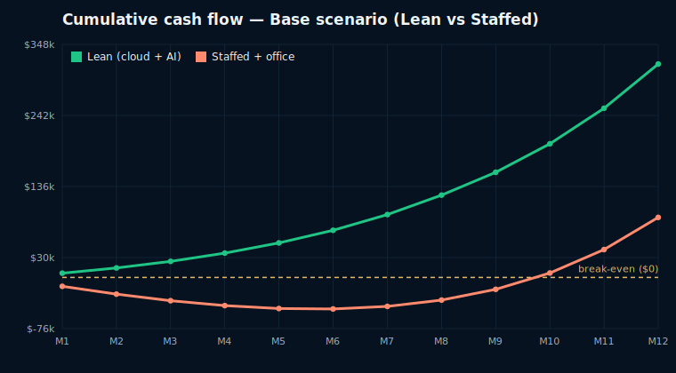

# 12‑Month Cash‑Flow Projection — Lean (Cloud + AI) vs Staffed

Companion to `docs/OPERATING_COST_LEAN_VS_STAFFED.md`. Models monthly revenue, costs,
and cumulative cash flow for the paid MVP under three growth scenarios, comparing the
**lean (cloud + AI‑first support)** operating model against a **staffed support desk +
office**. Figures are illustrative planning estimates from the assumptions below;
recompute with real numbers as they arrive.

## Assumptions

- **Blended ARPU:** $70/user/mo (mostly Consumer $50 with some Professional $299).
- **Support load:** ~0.5 tickets/user/mo.
- **Cloud + tooling (both models, tiered by users):** $450 (<500) / $800 (<1,500) /
  $1,300 (<3,000) / $2,200 (≥3,000).
- **Lean support:** AI at ~$0.05/ticket all‑in; add a fractional human at 500+ users
  ($1,500/mo), a second at 2,000+ ($3,000/mo total).
- **Staffed support:** agents = max(3 for 24/7, ⌈tickets/900⌉) at $4,800 fully‑loaded
  each; + $5,200/mo office & overhead (on top of the same cloud/tooling).
- **Stripe:** 2.9% of revenue + $0.30 per paying user.
- **Growth (month‑end paying users, compounding, illustrative):** Conservative 50→300,
  Base 100→1,010, Optimistic 150→2,876.

## Scenario summary (12 months)

| Scenario | M12 users | M12 MRR | **12‑mo cumulative — LEAN** | 12‑mo cumulative — STAFFED | Staffed turns cumulative‑positive |
| --- | ---: | ---: | ---: | ---: | --- |
| Conservative | 300 | $21k | **+$110,500** | **−$124,600** | not within 12 mo |
| Base | 1,010 | $70.7k | **+$318,700** | +$89,600 | ~month 10 |
| Optimistic | 2,876 | $201k | **+$770,400** | +$549,000 | ~month 6 |

**Lean is cash‑flow positive from month 1 in every scenario.** The staffed model is
deeply negative early and, in the Conservative case, **never recovers within year 1
(−$125k)**.

## Base scenario — full monthly detail

| M | Users | Revenue | Lean cost | Staffed cost | Net (lean) | Net (staffed) | Cum (lean) | Cum (staffed) |
| ---: | ---: | ---: | ---: | ---: | ---: | ---: | ---: | ---: |
| 1 | 100 | 7,000 | 452 | 20,050 | 6,314 | −13,283 | 6,314 | −13,283 |
| 2 | 123 | 8,610 | 453 | 20,050 | 7,870 | −11,727 | 14,185 | −25,010 |
| 3 | 152 | 10,640 | 454 | 20,050 | 9,832 | −9,764 | 24,017 | −34,774 |
| 4 | 188 | 13,160 | 455 | 20,050 | 12,267 | −7,328 | 36,284 | −42,102 |
| 5 | 232 | 16,240 | 456 | 20,050 | 15,244 | −4,351 | 51,528 | −46,452 |
| 6 | 286 | 20,020 | 457 | 20,050 | 18,896 | −696 | 70,424 | −47,149 |
| 7 | 353 | 24,710 | 459 | 20,050 | 23,429 | 3,838 | 93,853 | −43,311 |
| 8 | 436 | 30,520 | 461 | 20,050 | 29,043 | 9,454 | 122,896 | −33,857 |
| 9 | 538 | 37,660 | 2,313 | 20,400 | 34,093 | 16,006 | 156,989 | −17,851 |
| 10 | 663 | 46,410 | 2,317 | 20,400 | 42,549 | 24,465 | 199,538 | 6,615 |
| 11 | 819 | 57,330 | 2,320 | 20,400 | 53,101 | 35,022 | 252,639 | 41,636 |
| 12 | 1,010 | 70,700 | 2,325 | 20,400 | 66,021 | 47,947 | 318,660 | 89,583 |

## Downloads & chart

- CSVs (one per scenario + summary): `docs/projections/cashflow_{conservative,base,optimistic}.csv`,
  `docs/projections/summary.csv`.
- Break-even charts (SVG): `docs/projections/breakeven_{conservative,base,optimistic}.svg`.
- Regenerate anytime: `python3 docs/projections/generate_projections.py`.

Break-even (Base scenario) — lean is positive from month 1; staffed crosses ~month 10:

## Insights

1. **Lean prints cash immediately.** Even Conservative is +$2.9k in month 1 and
   +$110k cumulative by month 12 — self‑funding, no outside capital required to
   operate.
2. **Staffing too early is the #1 cash risk.** The fixed ~$20k/mo desk + office burns
   ~$125k in the Conservative case and delays profitability to ~month 10 even in Base.
3. **Lean preserves ~$220–235k of cash over 12 months** vs staffed across every
   scenario — roughly the annual cost of the support desk + office, kept on the
   balance sheet (extends runway / funds growth).
4. **The gap is the option value.** Staying lean lets you spend that ~$220k on
   acquisition, product, or hiring *when the triggers fire* — instead of fixed
   overhead before product‑market fit.

## Recommendation

- **Run lean through the MVP.** AI‑first 24/7 support (already built) + a fractional
  human for escalations; reinvest the preserved cash into growth.
- **Hire against demand, not hope.** Add support staff only when the triggers in
  `docs/OPERATING_COST_LEAN_VS_STAFFED.md` fire (sustained >~1,500–2,000 tickets/mo,
  enterprise contracts, escalation rate >15–20%, or compliance needs) — remote‑first,
  office last.
- **Re‑forecast monthly** with real ARPU, churn, and ticket rates; the script behind
  these tables can be re‑run in minutes.
