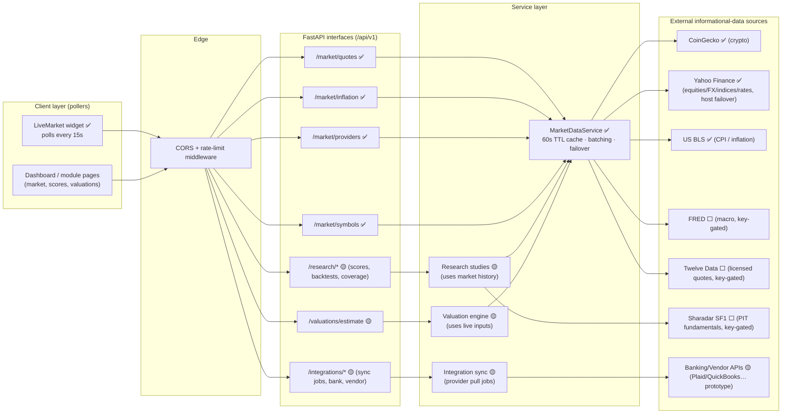
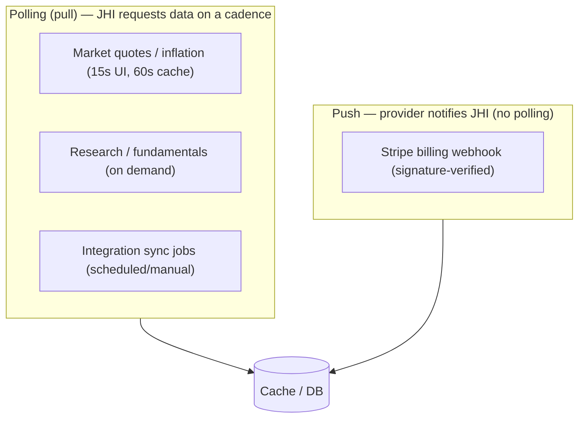

# Data-Polling Interfaces — Platform Flowchart (JHI)

> **Purpose (Friday request):** one consolidated flowchart showing **all systems and the
> interfaces required for polling informational data** across the John Henry Investments
> platform — what is polled, by whom, how often, with what caching/failover, and which
> interfaces are **pull** (polling) vs **push** (webhooks).
>
> Grounded in the real code: `src/components/live-market.tsx`,
> `backend/app/routers/market.py`, `backend/app/market_services.py`,
> `routers/{research,valuations,integrations,billing}.py`.
>
> **Legend:** ✅ live · 🟡 partial/prototype · ⬜ key-gated (inactive until credentials).
> **Cadence facts:** UI polls `GET /market/quotes` every **15s**; the backend caches each
> provider call for **60s** (TTL), so upstream providers are hit at most ~once/60s per key
> regardless of how many clients poll.

---

## 1. Master data-polling map (all systems + interfaces)



## 2. Polling cycle — cadence & caching (sequence)

```mermaid
sequenceDiagram
  participant UI as LiveMarket (client)
  participant API as /market/quotes
  participant MDS as MarketDataService
  participant Cache as 60s TTL cache
  participant Prov as Providers (CoinGecko/Yahoo/BLS)

  loop every 15 seconds
    UI->>API: GET /market/quotes?symbols=...
    API->>MDS: quotes(symbols)
    MDS->>Cache: lookup per-provider key
    alt cache fresh (< 60s)
      Cache-->>MDS: cached value
    else cache miss/expired
      MDS->>Prov: fetch (batched; Yahoo host failover)
      Prov-->>MDS: price / % change / as_of
      MDS->>Cache: store (ttl=60s)
    end
    MDS-->>API: quotes (each with status ok/unavailable)
    API-->>UI: JSON (degrades per-symbol, never 500s)
  end
```

> Because the cache TTL (60s) is longer than the UI poll interval (15s), ~3 of every 4
> polls are served from cache — protecting upstream rate limits while keeping the UI fresh.

## 3. Interface inventory — what is polled (pull) vs pushed

| Interface | Data polled | Transport | Auth/key | Cadence | Pull/Push | Status |
| --- | --- | --- | --- | --- | --- | --- |
| `LiveMarket → /market/quotes` | Live multi-asset quotes | HTTPS/JSON | none (public) | UI 15s | Pull | ✅ |
| `MarketDataService → CoinGecko` | Crypto spot + 24h | HTTPS/JSON | none | ≤1/60s (cache) | Pull | ✅ |
| `MarketDataService → Yahoo Finance` | Equities/FX/indices/rates | HTTPS/JSON | none | ≤1/60s | Pull (host failover) | ✅ |
| `MarketDataService → US BLS` | CPI / inflation YoY | HTTPS/JSON | none | ≤1/60s | Pull | ✅ |
| `MarketDataService → FRED` | Macro series | HTTPS/JSON | `FRED_API_KEY` | ≤1/60s | Pull | ⬜ key-gated |
| `MarketDataService → Twelve Data` | Licensed quotes | HTTPS/JSON | `TWELVEDATA_API_KEY` | ≤1/60s | Pull | ⬜ key-gated |
| `/research/* → Sharadar SF1` | PIT fundamentals | HTTPS/JSON | `NASDAQ_DATA_LINK_API_KEY` | on demand | Pull | ⬜ key-gated |
| `/valuations/estimate` | Modeled illiquid values | internal | auth (target) | on demand | Pull (derives from market) | 🟡 |
| `/integrations/sync-jobs`, `/banking/transactions`, `/vendor/bills` | Bank/vendor/accounting | HTTPS/JSON | per-provider creds | scheduled/manual | Pull (sync) | 🟡 |
| `/billing/webhook` | Subscription events | HTTPS/JSON | **Stripe signature** | event-driven | **Push** (not polled) | ✅ verified |

## 4. Pull vs push (important distinction)



## 5. Resilience & control points

- **Per-symbol graceful degradation:** a failed provider returns `status = "unavailable"`
  for that symbol; the endpoint never 500s on an outage.
- **Caching:** 60s in-memory TTL per provider key; crypto symbols batched into one call.
- **Failover:** Yahoo uses multiple hosts; key-gated providers stay inactive (advertised
  in `/market/providers`) until credentials exist.
- **Backpressure:** rate-limit middleware (env-gated) throttles abusive clients on `/api/v1/*`.
- **Recommended next:** move the cache to Redis (shared across instances) and add a
  scheduled background poller so the cache is warm independent of UI traffic.

---

## Status of the Friday request

✅ **Now complete.** This document is the dedicated flowchart of **all systems and the
interfaces required for polling informational data**, with cadence, caching, failover,
and the pull-vs-push distinction. It complements:

- `docs/ORGANIZATION_CHARTS.md` — Part B as-built system map + interface inventory.
- `docs/SYSTEM_FLOWCHARTS_AND_PROCESS_MAPS.md` — full-vision system & integration maps.
- `docs/MARKET_DATA_SOURCES.md` — provider details, endpoints, caching/resilience.
