# John Henry Investments — Organization Charts (Company + Platform)

> Two complementary views, both rendered as Mermaid diagrams (GitHub/Cursor compatible):
>
> - **Part A — Company organization chart:** departments, roles, reporting lines, the
>   **five AI customer-service agents**, and how the org grows by staffing stage. Grounded
>   in `docs/JOB_DESCRIPTIONS_AND_STAFFING_REQUIREMENTS.md`.
> - **Part B — Platform organization chart (as-built):** the complete system, every
>   interface, and command→action flows for the features actually implemented in this
>   codebase. Complements the full-vision `docs/SYSTEM_FLOWCHARTS_AND_PROCESS_MAPS.md`.
>
> **Legend for build status (Part B):** ✅ built & tested · 🟡 partial/prototype · ⬜ planned.

---

# Part A — Company Organization Chart

## A1. Company-wide org chart (full build-out)

Solid lines = direct reports. Dashed lines = fractional / outside advisors.

```mermaid
flowchart TD
  CEO["Founder / CEO<br/>(strategy, capital, governance)"]

  COO["COO / Operations Lead"]
  CTO["CTO / Technical Lead"]
  HoP["Head of Product"]
  AIDL["AI / Data / Research Lead"]
  HoS["Head of Sales & Partnerships"]
  FIN["Controller / Finance Lead"]
  CS["Customer Success Lead"]

  GC["Outside General Counsel"]
  COMP["Compliance Officer / Advisor"]
  CPA["CPA / Bookkeeper"]

  CEO --> COO
  CEO --> CTO
  CEO --> HoP
  CEO --> AIDL
  CEO --> HoS
  CEO --> FIN
  CEO -.-> GC
  CEO -.-> COMP

  %% Engineering
  CTO --> FSE["Full-Stack Engineer"]
  CTO --> BE["Backend Engineer"]
  CTO --> FE["Frontend Engineer"]
  CTO --> INT["Integration Engineer"]
  CTO --> DEVOPS["DevOps / Cloud Engineer"]
  CTO --> SEC["Security Engineer"]
  CTO --> QA["QA Engineer / Test Analyst"]

  %% Product
  HoP --> UX["UX / UI Designer"]

  %% AI / Data / Research
  AIDL --> AIE["AI Engineer"]
  AIDL --> DS["Data Scientist / Quant Analyst"]
  AIDL --> FRA["Financial Research Analyst"]

  %% Sales
  HoS --> AE["Account Executive(s)"]

  %% Finance
  FIN --> CPA
  FIN --> FPA["FP&A Lead"]

  %% Customer success + AI agent team (see A3)
  COO --> CS
  CS --> CSM["Customer Success Manager"]
  CS --> SUP["Support Specialist"]
  CS --> AITEAM["AI Customer-Service Team<br/>(5 agents — see A3)"]

  %% Operations & admin
  COO --> OPS["Operations Manager"]
  COO --> HR["HR / People Ops"]

  %% Legal specialists under outside counsel
  GC -.-> SECC["Securities / Investment Adviser Counsel"]
  GC -.-> PRIV["Privacy / Data Protection Counsel"]
  GC -.-> EMP["Employment Counsel"]
  GC -.-> IP["IP / Trademark Counsel"]
```

## A2. Departments at a glance

| Department | Leader | Core purpose |
| --- | --- | --- |
| Executive leadership | Founder / CEO, COO | Strategy, capital, partnerships, governance |
| Product & design | Head of Product | Roadmap, UX, requirements, research |
| Engineering | CTO / Technical Lead | Frontend, backend, integrations, DB, reliability |
| AI, data & research | AI/Data/Research Lead | AI assistant, Opportunity Score, data models, research |
| Security & DevOps | (under CTO) | Infra, access control, cloud ops, incident response |
| Legal & compliance | Outside General Counsel | Terms, privacy, securities review, vendor contracts |
| Finance & accounting | Controller / Finance Lead | Bookkeeping, reporting, billing controls, FP&A |
| Sales & partnerships | Head of Sales | Revenue, enterprise pipeline, referral relationships |
| Customer success & support | Customer Success Lead | Onboarding, retention, support, training |
| Operations & administration | Operations Manager | Vendors, HR, procurement, internal process |
| Quality assurance | (under CTO) | Testing, release quality, regression, acceptance |

## A3. The five AI customer-service agents (operational layer)

These are **AI agents implemented in the platform** (`backend/app/agents_services.py`,
`/api/v1/agents`), accounted for as operating-cost centers (not payroll) per
`docs/AI_AGENT_OPERATING_COST.md`. They form the front line of customer service and sit
within Customer Success, with the **founder as the escalation owner**.

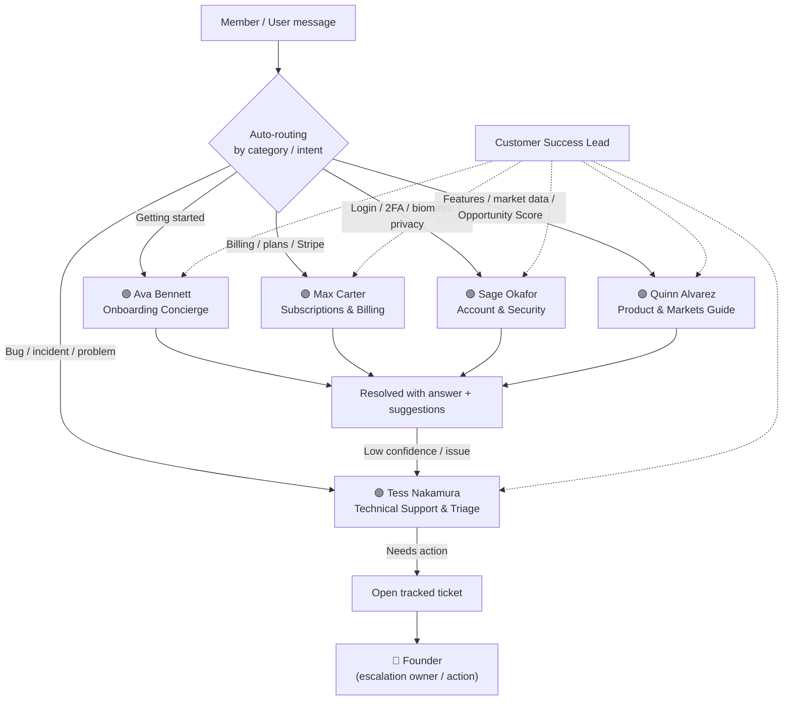

**Agent roster & responsibilities:**

| Agent | Role | Handles (categories) | Escalates? |
| --- | --- | --- | --- |
| **Ava Bennett** | Onboarding Concierge | Getting started, account setup, walkthroughs, activation | No |
| **Max Carter** | Subscriptions & Billing Specialist | Plans, pricing/upgrades, billing/invoices, Stripe | No |
| **Sage Okafor** | Account & Security Agent | Authentication, 2FA/biometric, data protection, privacy | No |
| **Quinn Alvarez** | Product & Markets Guide | Opportunity Score, live market data, modules, how-to (no advice) | No |
| **Tess Nakamura** | Technical Support & Triage | Incident triage, troubleshooting, bug intake → **founder** | **Yes** |

Routing logic: messages are matched to a category → mapped to the owning agent;
issue-like messages (or any low-confidence answer) route to **Tess**, who triages and
forwards anything needing action to the **founder** as a tracked ticket.

## A4. Org by staffing stage (grows with revenue/risk)

Staffing follows revenue and risk — not all roles are hired at once.

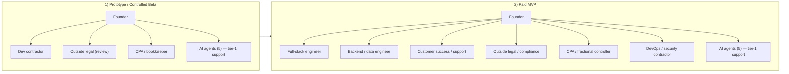

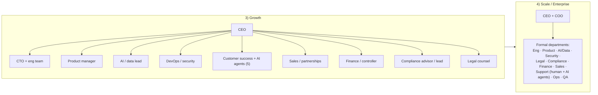

---

# Part B — Platform Organization Chart (as-built)

This reflects **what exists in this repository today**: a Next.js frontend, a FastAPI
backend with 14 router groups, durable SQL persistence, and live/external data adapters.

## B1. Complete system map (layered)

```mermaid
flowchart TB
  subgraph Clients["Clients"]
    Web["Next.js Web App ✅<br/>(marketing + app pages)"]
    Mobile["Mobile App /mobile ✅<br/>(live: password, 2FA, biometric)"]
  end

  subgraph Edge["Cross-cutting middleware ✅"]
    CORS["CORS (allowed origins)"]
    RL["Rate-limit middleware (env-gated)"]
    AUTHZ["Token auth + scoped tokens"]
  end

  subgraph API["FastAPI backend — router groups (/api/v1)"]
    direction TB
    R_auth["/auth ✅ register/login/me"]
    R_mobile["/auth (mobile) ✅ 2FA, biometric, security"]
    R_billing["/billing ✅ plans, checkout, webhook(verified)"]
    R_acct["/accounting ✅ COA, journal, trial balance"]
    R_reports["/reports ✅ financial, audit"]
    R_dash["/dashboards ✅ executive"]
    R_crm["/crm ✅ contacts, deals, activities"]
    R_market["/market ✅ quotes, providers, inflation"]
    R_research["/research 🟡 scores, backtests, coverage"]
    R_val["/valuations 🟡 illiquid estimates"]
    R_support["/support ✅ faq, ask"]
    R_agents["/agents ✅ roster, message, tickets"]
    R_leads["/leads ✅ capture, count"]
    R_intg["/integrations 🟡 connectors, sync, exports"]
  end

  subgraph Services["Service layer"]
    S_found["Foundation (auth/billing/audit) ✅"]
    S_mob["Mobile auth (TOTP+WebAuthn) ✅"]
    S_sec["Security (JWT, Fernet, TOTP) ✅"]
    S_acct["Accounting ✅"]
    S_crm["CRM ✅"]
    S_report["Reporting/Dashboards ✅"]
    S_market["Market data adapters ✅"]
    S_score["Opportunity Score 🟡"]
    S_research["Research studies 🟡"]
    S_val["Valuation engine 🟡"]
    S_agents["Agent routing + tickets ✅"]
    S_support["Support FAQ retrieval ✅"]
  end

  subgraph Data["Persistence ✅"]
    DB["SQLAlchemy ORM<br/>SQLite (dev) / Postgres (prod)"]
    Audit["Audit logs"]
  end

  subgraph Ext["External interfaces"]
    Stripe["Stripe 🟡 (webhook sig verified ✅)"]
    CoinGecko["CoinGecko ✅"]
    Yahoo["Yahoo Finance ✅"]
    BLS["US BLS ✅"]
    FRED["FRED ⬜ key-gated"]
    TwelveData["Twelve Data ⬜ key-gated"]
    Sharadar["Sharadar SF1 ⬜ key-gated"]
  end

  Web --> Edge
  Mobile --> Edge
  Edge --> API
  API --> Services
  Services --> Data
  S_found --> Audit
  S_agents --> DB
  R_billing --> Stripe
  S_market --> CoinGecko
  S_market --> Yahoo
  S_market --> BLS
  S_market --> FRED
  S_market --> TwelveData
  S_research --> Sharadar
```

## B2. Interface inventory (every interface required)

### Frontend routes (Next.js)

| Route | Purpose | Talks to backend? |
| --- | --- | --- |
| `/` | Marketing landing + mission + waitlist | 🟡 docs routes; waitlist ✅ |
| `/login`, `/register` | Auth entry | 🟡 prototype |
| `/mobile` | Live mobile app (sign-in, 2FA, biometric, status) | ✅ yes |
| `/dashboard` | Executive + live market widgets | ✅ live market |
| `/opportunities`, `/portfolio`, `/reports`, `/due-diligence`, `/assistant`, `/account` | Module pages | 🟡 mostly static |
| `/pricing` | Plans/tiers | 🟡 documents plans |
| `/support` | AI assistant chat (agent-routed) | ✅ yes |
| `/team` | AI agent roster profiles | ✅ yes |
| `/join` | Waitlist funnel | ✅ yes |

### Backend API (as-built endpoints, prefix `/api/v1`)

| Group | Endpoints | Status |
| --- | --- | --- |
| `/auth` | `POST /register`, `POST /login`, `GET /me` | ✅ |
| `/auth` (mobile) | `POST /login/initiate`, `/2fa/{verify,dev-code,enable,disable}`, `/biometric/{register,challenge,assert}`, `GET /security/status` | ✅ |
| `/billing` | `GET /plans`, `GET /subscription`, `POST /checkout-session`, `POST /webhook`, `GET /audit-logs` | ✅ (webhook signature-verified) |
| `/accounting` | `GET /chart-of-accounts`, `/journal-entries`, `/trial-balance` | ✅ |
| `/reports` | `GET /audit`, `/financial` | ✅ |
| `/dashboards` | `GET /executive` | ✅ |
| `/crm` | `GET/POST /contacts`, `/deals`, `/activities`, `GET /summary` | ✅ |
| `/market` | `GET /quotes`, `/providers`, `/symbols`, `/inflation` | ✅ |
| `/research` | `GET /score-backtest`, `/opportunity-scores`, `/equity-oos-backtest`, `/fundamentals-status`, `/acquisition-validation`, `/data-coverage`, `/adoption` | 🟡 |
| `/valuations` | `GET /estimate` | 🟡 |
| `/support` | `GET /faq`, `POST /ask` | ✅ |
| `/agents` | `GET /` (roster), `POST /message`, `GET /tickets` | ✅ |
| `/leads` | `POST /`, `GET /count` | ✅ |
| `/integrations` | `GET /connectors`, `/connections`, `POST/GET /sync-jobs`, `GET /banking/transactions`, `POST/GET /vendor/bills`, `POST /office/export-package` | 🟡 |
| ops | `GET /health`, `GET /ready` | ✅ |

### External interfaces

| Interface | Use | Status |
| --- | --- | --- |
| Stripe | Checkout + webhook (signature verified) | 🟡 (verification ✅) |
| CoinGecko / Yahoo Finance / US BLS | Live crypto, equities/FX, inflation | ✅ |
| FRED / Twelve Data / Sharadar SF1 | Macro / licensed quotes / PIT fundamentals | ⬜ key-gated |

## B3. Core request/response protocol (every protected call)

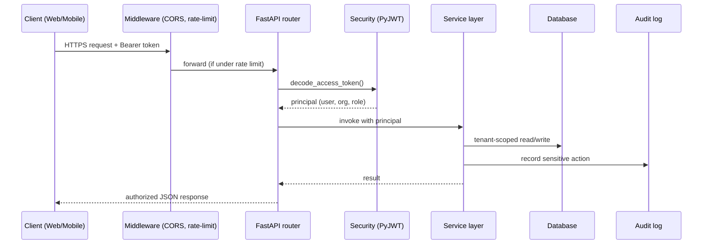

## B4. Command → action flows (as-built features)

### Sign-up & login

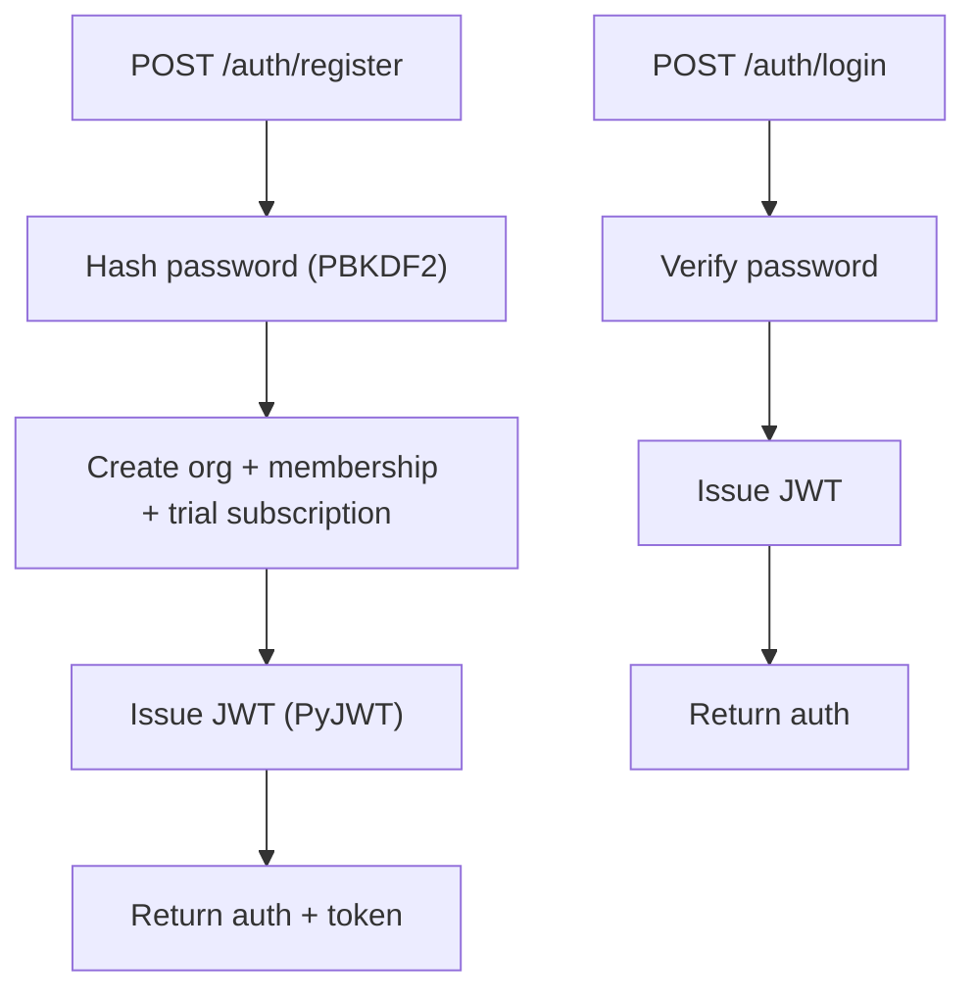

### Two-factor (TOTP) — secret encrypted at rest ✅

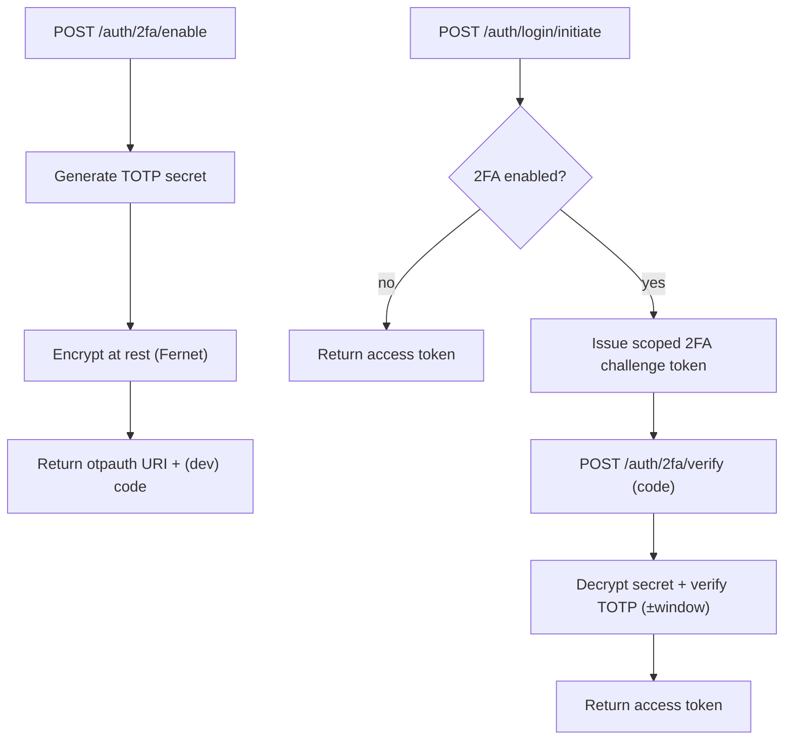

### Biometric (real WebAuthn ES256) ✅

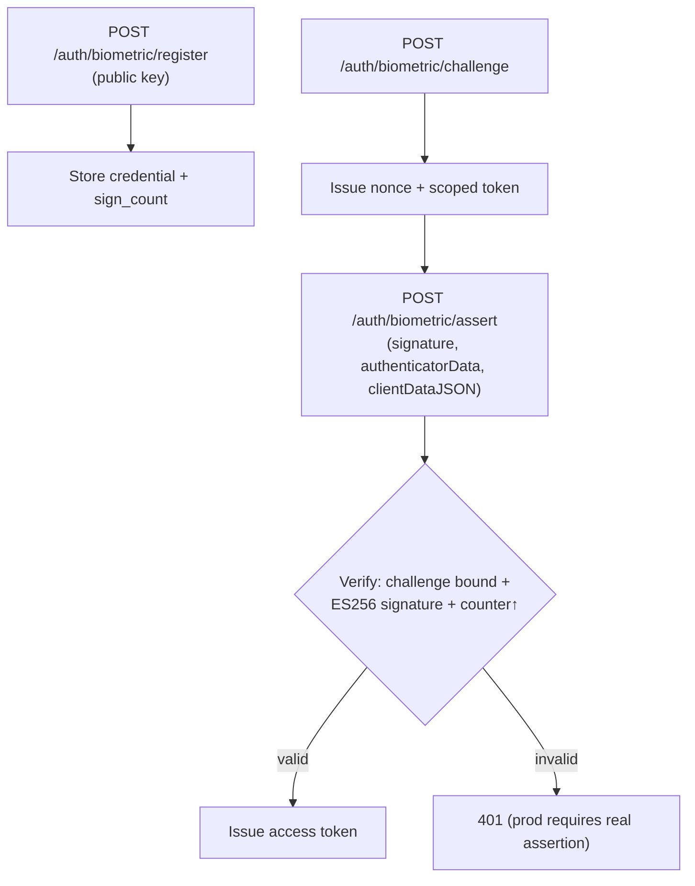

### Billing checkout + verified webhook ✅

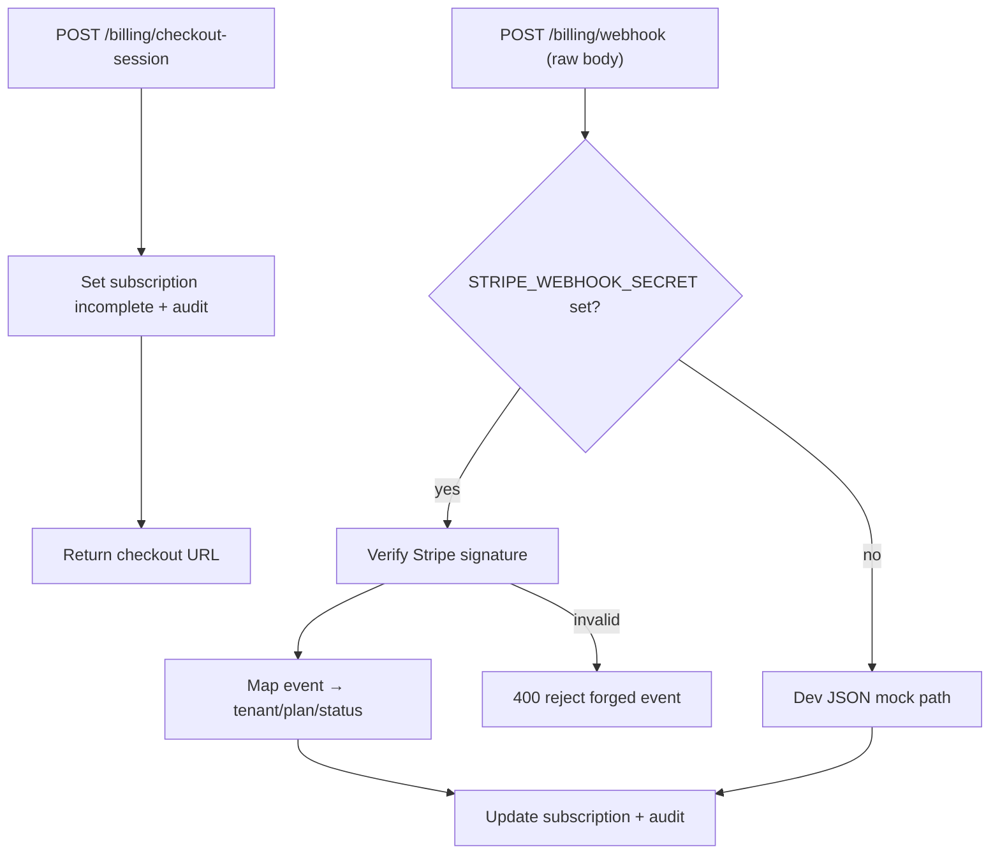

### AI customer service (agent routing + escalation) ✅

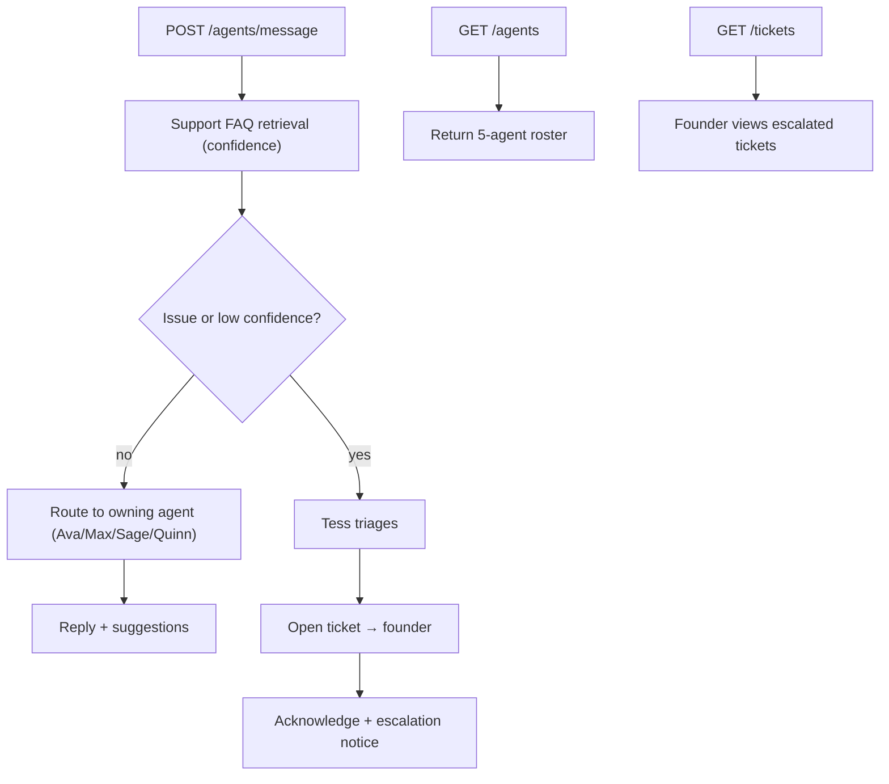

### Other as-built commands

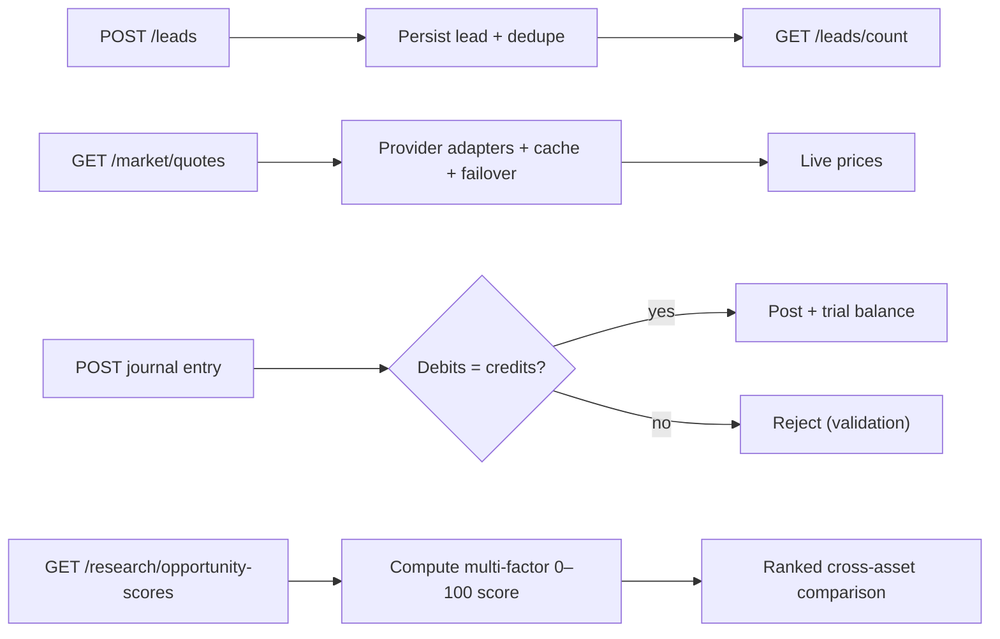

## B5. As-built module dependency map

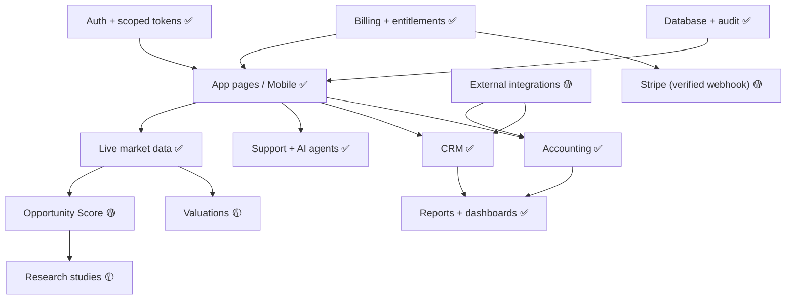

---

## Notes & cross-references

- Company roles, levels, and credential requirements: `docs/JOB_DESCRIPTIONS_AND_STAFFING_REQUIREMENTS.md`.
- AI agent profiles & cost accounting: `docs/AI_AGENT_TEAM_PROFILES.md`, `docs/AI_AGENT_OPERATING_COST.md`.
- Full **vision** flowcharts (all planned modules): `docs/SYSTEM_FLOWCHARTS_AND_PROCESS_MAPS.md`.
- As-built code objectives & audit: `docs/CODE_OBJECTIVES.md`, `docs/SRC_CODE_AUDIT.md`.
- Security model behind the auth/2FA/biometric/webhook flows: `docs/SECURITY_POSTURE_AND_DATA_PROTECTION.md`.
