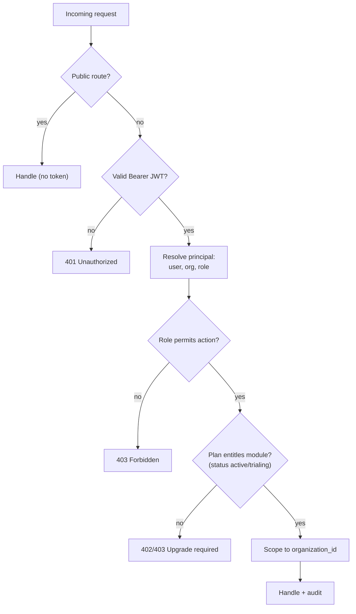
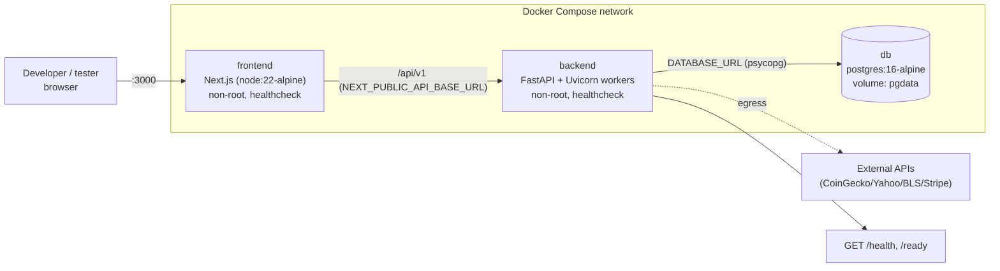
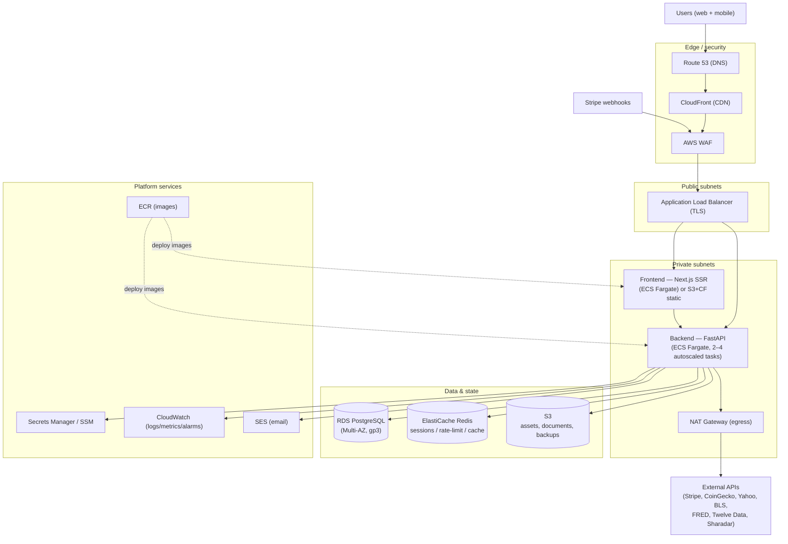
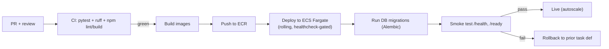

# Role-Based Access Matrix & Deployment Architecture

> Two operational references for John Henry Investments (JHI):
>
> - **Part A — Role-based access matrix:** roles, plans, the **as-built** access
>   enforcement (honest), and the **recommended target** RBAC by role × capability and
>   plan × module.
> - **Part B — Deployment architecture:** the **as-built** Docker sandbox topology and
>   the **target AWS production** architecture (from `docs/AWS_COST_10K_USERS.md`).
>
> **Legend:** ✅ enforced today · 🟡 partial · ⬜ recommended/not yet enforced.
> Security context: `docs/SECURITY_POSTURE_AND_DATA_PROTECTION.md` (RBAC is a known P1 gap).

---

# Part A — Role-Based Access Matrix

## A1. Roles and plans (from the code)

**Identity roles** (`UserRole`, carried in the JWT as `role`; org owner defaults to `admin`):

| Role | Meaning |
| --- | --- |
| `admin` | Organization owner/administrator (manages org, billing, members) |
| `investor` | Standard individual member |
| `advisor`, `cpa`, `attorney`, `banker` | Professional member user-types (B2B) |
| `family_office`, `enterprise` | Enterprise / multi-seat member user-types |
| _platform/founder_ | Super-admin (operational; not a tenant role) |

**Subscription plans** (`SubscriptionPlan`): `consumer` ($50) · `professional` ($299) ·
`enterprise` ($1,500+). **Status** (`SubscriptionStatus`): trialing, active, past_due,
canceled, incomplete — gates entitlements.

## A2. As-built access enforcement (honest current state)

Today the backend enforces **three levels**: public (no token), authenticated
(`get_current_principal`), and admin-only (`require_admin`). Most module endpoints are
currently **public** — the documented RBAC P1 gap.

| Endpoint group | Current enforcement | Notes |
| --- | --- | --- |
| `/auth/register`, `/auth/login` | 🟢 Public (by design) | Account creation/login |
| `/auth/login/initiate`, `/2fa/verify`, `/2fa/dev-code`, `/biometric/challenge`, `/biometric/assert` | 🟢 Public (pre-auth flows, by design) | `dev-code` disabled in prod |
| `/auth/me` | ✅ Authenticated | |
| `/auth/2fa/enable`,`/2fa/disable`,`/biometric/register`,`/security/status` | ✅ Authenticated | |
| `/billing/subscription`, `/billing/checkout-session` | ✅ Authenticated | |
| `/billing/webhook` | 🟢 Public + **Stripe signature verified** ✅ | Forged events rejected |
| `/billing/audit-logs` | ✅ **Admin only** | `require_admin` |
| `/agents` (roster), `/agents/message` | 🟢 Public (by design) | Customer service |
| `/agents/tickets` | ✅ Authenticated | Founder/admin views escalations |
| `/leads` POST, `/leads/count` | 🟢 Public (by design) | Waitlist capture |
| `/leads` GET (list) | ✅ Authenticated | |
| `/research/adoption` | ✅ Authenticated | |
| `/market/*`, `/support/*` | 🟢 Public (by design) | Market data, FAQ |
| `/accounting/*`, `/crm/*`, `/reports/*`, `/dashboards/*`, `/valuations/*`, `/integrations/*`, most `/research/*` | ⬜ **Public today — should require auth + RBAC** | P1 gap |
| `/health`, `/ready` | 🟢 Public (probes) | |

## A3. Access-control decision flow

> Today the flow enforces the **public → token → admin** branches; the **role-permits**
> and **plan-entitles** branches (dashed in intent) are the recommended target below.

## A4. Recommended target — capability matrix by role

✅ allowed · ➖ read-only/limited · ❌ denied

| Capability | Founder/Platform | Org Admin | Member (investor) | Professional (advisor/cpa/attorney/banker) | Enterprise / Family Office |
| --- | --- | --- | --- | --- | --- |
| Manage org & members | ✅ | ✅ | ❌ | ❌ | ➖ (seat admins) |
| Billing & subscription | ✅ | ✅ | ❌ | ❌ | ✅ |
| View audit logs | ✅ | ✅ (own org) | ❌ | ❌ | ➖ |
| Dashboard / market data | ✅ | ✅ | ✅ | ✅ | ✅ |
| Opportunity Score / discovery | ✅ | ✅ | ✅ | ✅ | ✅ |
| Acquisition engine / due diligence | ✅ | ✅ | ➖ | ✅ | ✅ |
| CRM (contacts/deals) | ✅ | ✅ | ➖ | ✅ | ✅ |
| Accounting / financial reports | ✅ | ✅ | ❌ | ➖ | ✅ |
| Integrations (bank/vendor/Office) | ✅ | ✅ | ❌ | ➖ | ✅ |
| Branded/exported reports | ✅ | ✅ | ➖ | ✅ | ✅ |
| View escalated agent tickets | ✅ | ✅ | ❌ | ❌ | ➖ |
| Platform admin (all tenants) | ✅ | ❌ | ❌ | ❌ | ❌ |

## A5. Recommended target — module entitlement by plan

✅ included · ➖ limited · ❌ not in plan

| Module | Consumer ($50) | Professional ($299) | Enterprise ($1,500+) |
| --- | --- | --- | --- |
| Dashboard + live market data | ✅ | ✅ | ✅ |
| Opportunity Score / discovery | ✅ | ✅ | ✅ |
| Portfolio tracking | ➖ | ✅ | ✅ |
| Business acquisition engine | ❌ | ✅ | ✅ |
| AI due diligence center | ❌ | ➖ | ✅ |
| CRM pipeline | ❌ | ✅ | ✅ |
| Accounting / financial reports | ❌ | ➖ | ✅ |
| External integrations | ❌ | ➖ | ✅ |
| Team / multi-seat + roles | ❌ | ➖ | ✅ |
| AI support agents (Ava/Max/Sage/Quinn/Tess) | ✅ | ✅ | ✅ |
| Founder escalation (via Tess) | ✅ | ✅ | ✅ (priority) |

## A6. AI agents — access posture

The five AI customer-service agents are available to **all plans**. `/agents/message`
and the roster are intentionally public (pre-login support); **`/agents/tickets`
(escalations) is authenticated** and intended for the founder/admin. Recommendation:
gate `/agents/tickets` to `require_admin` (founder) specifically.

---

# Part B — Deployment Architecture

## B1. As-built — Docker sandbox (one command)

`docker compose up --build` runs three containers (from `docker-compose.yml`):

Notes: backend waits for `db` healthy; SQLite is the default outside compose (dev), but
compose wires Postgres. `WEB_CONCURRENCY` sets Uvicorn workers.

## B2. Target — AWS production architecture

From `docs/AWS_COST_10K_USERS.md` (Graviton/ARM, autoscaled; Multi-AZ for production):

## B3. Configuration & secrets by environment

| Variable | Dev (sandbox) | Production | Purpose |
| --- | --- | --- | --- |
| `APP_ENV` | `development` | `production` | Gates dev conveniences (e.g. 2FA dev-code) + fail-fast validation |
| `AUTH_JWT_SECRET` | dev default | **required, ≥32 bytes** | JWT signing (PyJWT HS256) |
| `APP_ENCRYPTION_KEY` | derived from JWT secret | **set dedicated Fernet key** | Encrypt TOTP/PII at rest |
| `DATABASE_URL` | sqlite / compose Postgres | **Postgres (RDS)** | Persistence (SQLite blocked in prod) |
| `STRIPE_WEBHOOK_SECRET` | unset (mock path) | **set** | Verify Stripe webhook signatures |
| `RATE_LIMIT_PER_MINUTE` | 0 (off) | **>0 (+ Redis shared store)** | Throttle abuse / brute force |
| `NEXT_PUBLIC_API_BASE_URL` | `http://localhost:8000/api/v1` | API origin | Frontend → backend base URL |
| `FRED_API_KEY`, `TWELVEDATA_API_KEY`, `NASDAQ_DATA_LINK_API_KEY` | optional | optional | Macro / licensed quotes / PIT fundamentals |

## B4. Release / deploy flow (target)

> CI/CD, Alembic migrations, Redis-backed rate limiting, and full RBAC are tracked in
> `docs/TODO_NEXT_SESSION.md`; cost detail is in `docs/AWS_COST_10K_USERS.md`.

---

## Cross-references

- Security model & P1 RBAC gap: `docs/SECURITY_POSTURE_AND_DATA_PROTECTION.md`
- AWS cost breakdown (10k users): `docs/AWS_COST_10K_USERS.md`
- System interfaces & command flows: `docs/ORGANIZATION_CHARTS.md`, `docs/SYSTEM_FLOWCHARTS_AND_PROCESS_MAPS.md`
- Plans & pricing fit: `docs/SERVICES_PRICING_FIT_ANALYSIS.md`
