# John Henry Investments System Flowcharts and Process Maps

## Purpose

This document maps the John Henry Investments platform with flowcharts for the full system, each major module, operating procedures, feedback loops, interface protocols, data movement, and control points.

All diagrams use Mermaid syntax so they can render in GitHub, Cursor, and compatible Markdown viewers.

## Diagram index

1. Entire system map
2. User, tenant, authentication, and billing lifecycle
3. Dashboard process flow
4. Investment discovery engine
5. Business acquisition engine
6. AI due diligence center
7. Global macro dashboard
8. Weekly intelligence reports
9. AI research assistant
10. Portfolio tracking
11. Wealth projection engine
12. Corporate governance center
13. Capital raising center
14. John Henry Opportunity Score
15. Accounting, audit, financial reporting, and CRM backend
16. External banking, vendor, Microsoft Office, and CRM integrations
17. Feedback loops
18. Interface protocol map
19. Data governance, audit, and compliance loop
20. Admin and operations control loop
21. Incident and exception flow

## 1. Entire system map

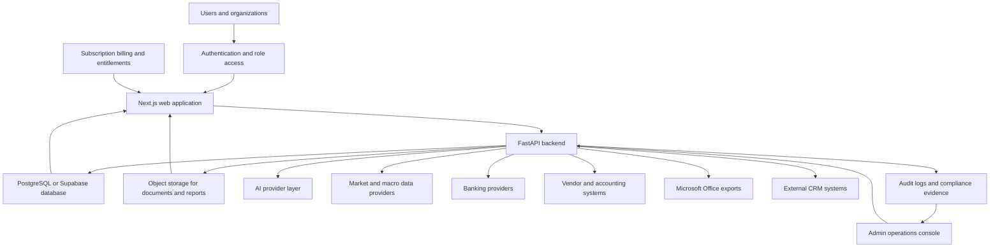

## 2. User, tenant, authentication, and billing lifecycle

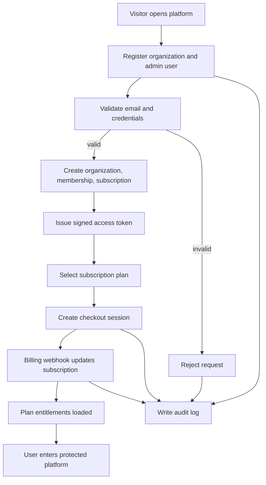

Procedure:

1. Capture organization, user, and selected plan.
2. Hash password and create persistent user record.
3. Create organization and membership.
4. Create trialing or incomplete subscription record.
5. Issue bearer token.
6. Start checkout when user selects paid plan.
7. Webhook updates subscription status.
8. Entitlements control access to paid modules.
9. Audit log records registration, login, checkout, and billing changes.

## 3. Dashboard process flow

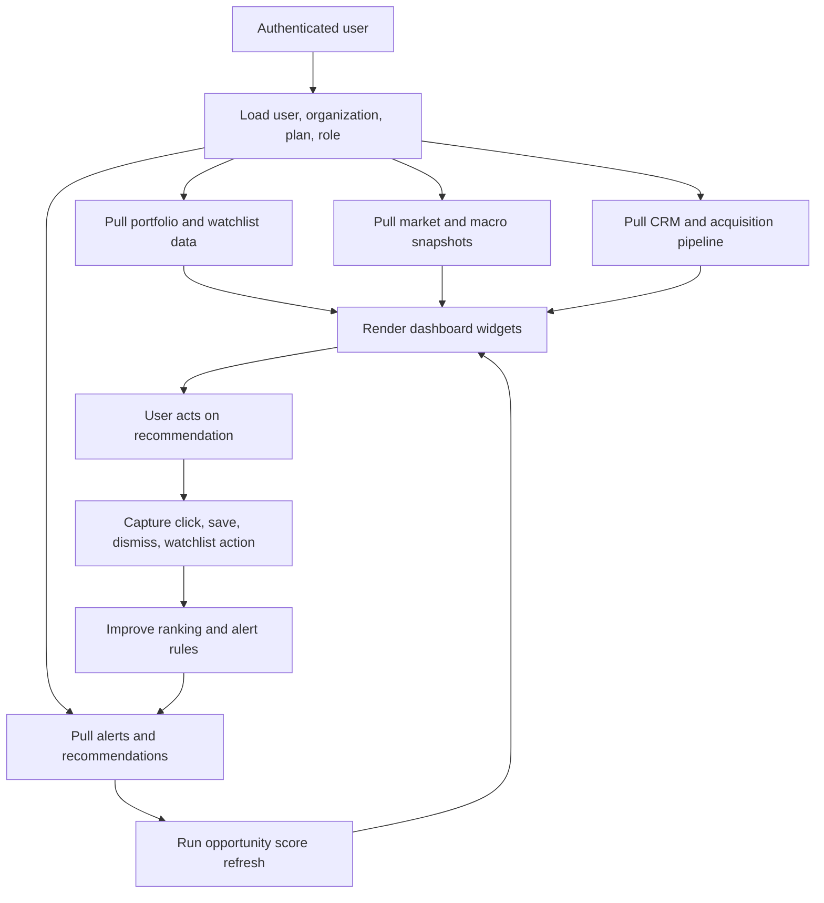

Interface protocol:

- Front end calls backend dashboard endpoint.
- Backend checks role and plan.
- Backend aggregates database records, market data, CRM records, portfolio records, and score outputs.
- Dashboard displays only data allowed by organization, role, and plan.

## 4. Investment discovery engine

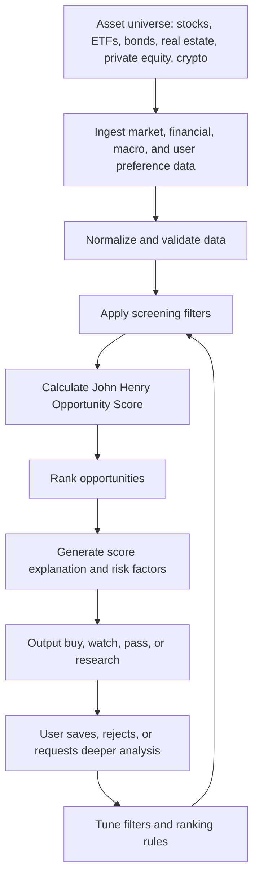

Procedure:

1. Define asset class and screening universe.
2. Pull market and financial data.
3. Apply valuation, growth, risk, income, and macro filters.
4. Score each opportunity from 0 to 100.
5. Return ranked list with explanation.
6. Feed user behavior into future ranking.

## 5. Business acquisition engine

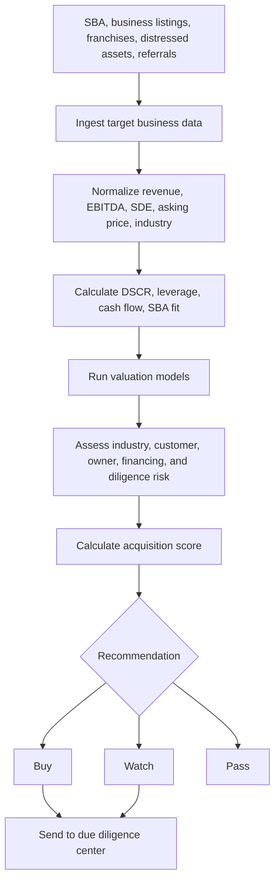

Procedure:

1. Capture acquisition target.
2. Normalize seller-provided data.
3. Estimate debt service coverage.
4. Test SBA qualification.
5. Run valuation and risk model.
6. Output Buy, Watch, or Pass.
7. Route viable targets to due diligence.

## 6. AI due diligence center

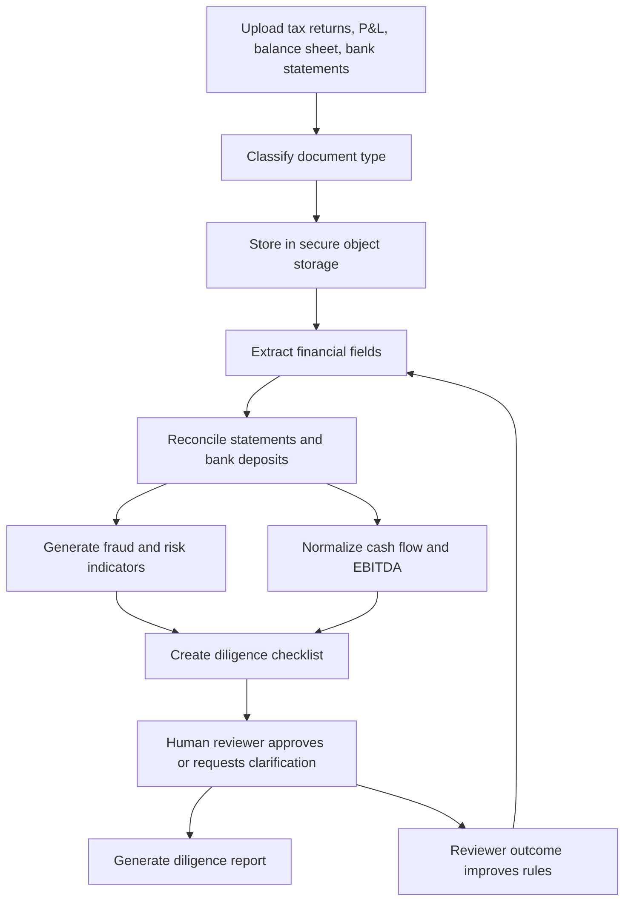

Control points:

- Virus scan before processing.
- Role-based document access.
- Audit log for upload, view, export, and deletion.
- Human review before high-risk recommendations.
- Legal disclaimer on AI-generated conclusions.

## 7. Global macro dashboard

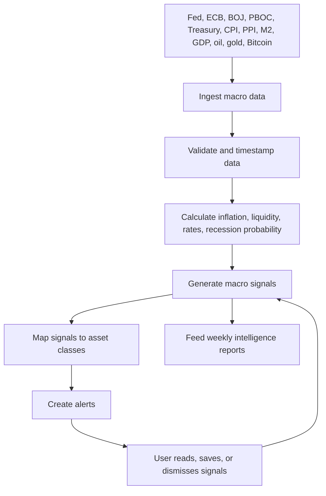

## 8. Weekly intelligence reports

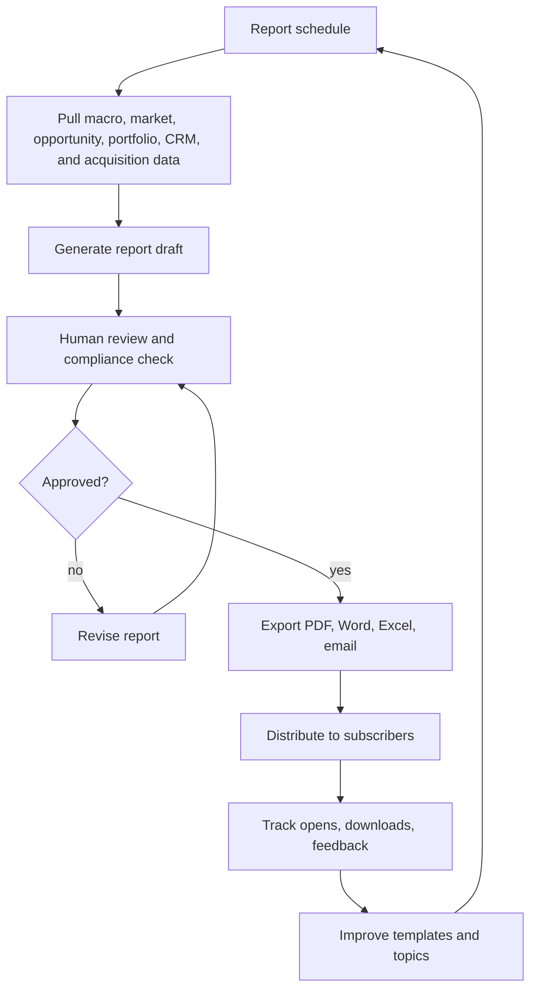

## 9. AI research assistant

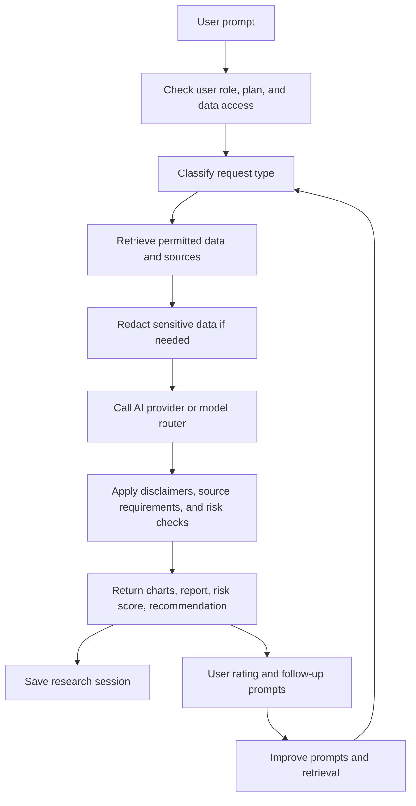

Interface protocol:

- Front end sends prompt and context ID.
- Backend verifies token, organization, role, and plan.
- Backend retrieves allowed records only.
- AI response includes disclaimer, sources, risk level, and output type.
- Audit log records sensitive research activity.

## 10. Portfolio tracking

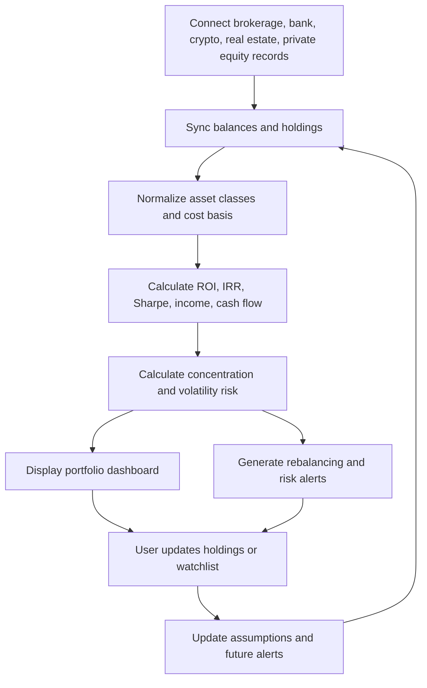

## 11. Wealth projection engine

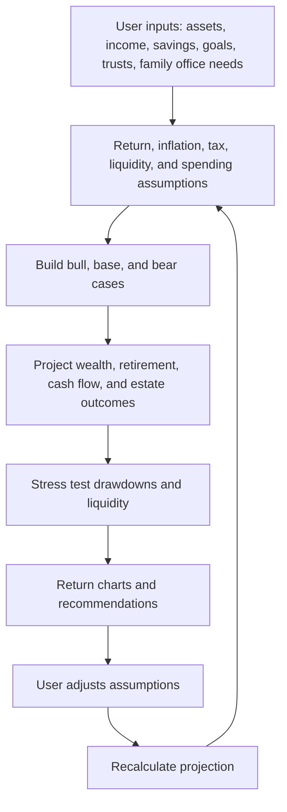

## 12. Corporate governance center

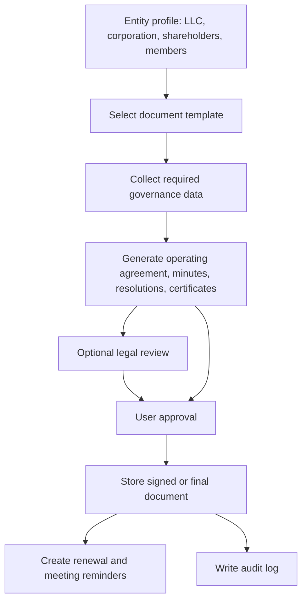

## 13. Capital raising center

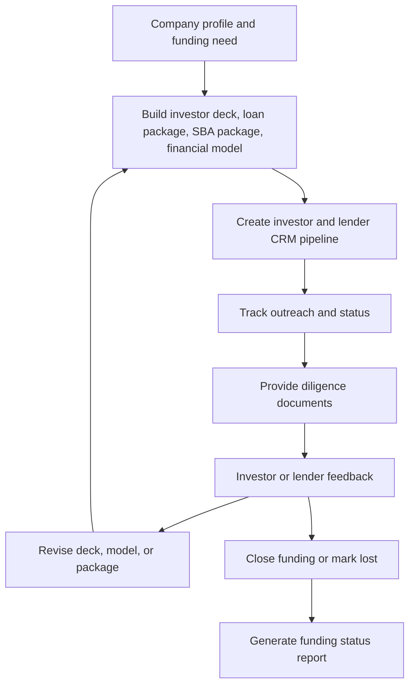

## 14. John Henry Opportunity Score

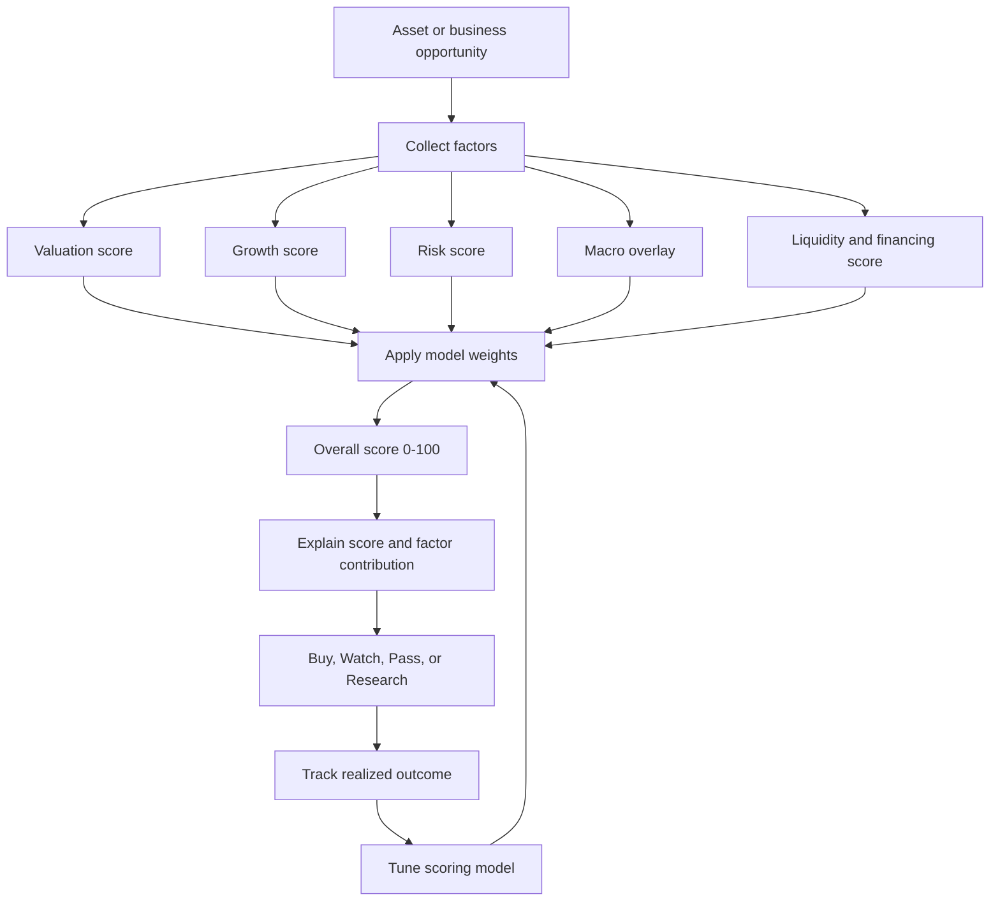

## 15. Accounting, audit, financial reporting, and CRM backend

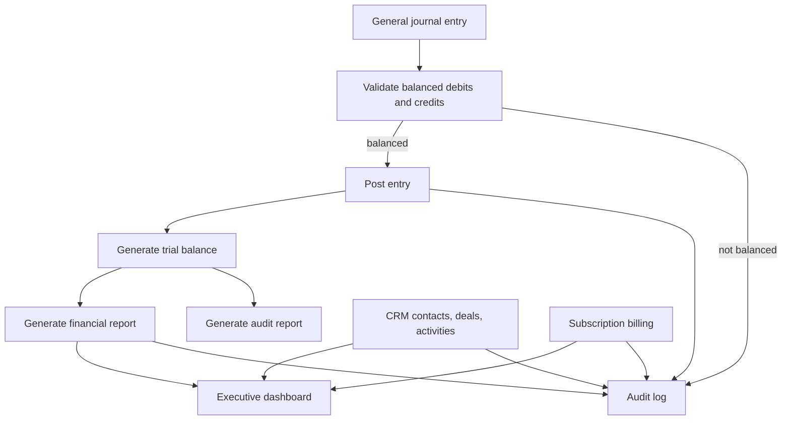

## 16. External integration protocol map

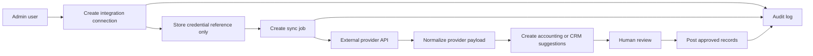

Supported interface groups:

- Banking: Plaid, MX, direct bank APIs.
- Vendor and accounting: QuickBooks, NetSuite, Bill.com.
- Microsoft Office: Excel, Word, CSV, PDF, OneDrive, SharePoint.
- CRM: Salesforce or equivalent enterprise CRM.
- Payments: Stripe checkout, billing portal, webhooks.

## 17. Microsoft Office export flow

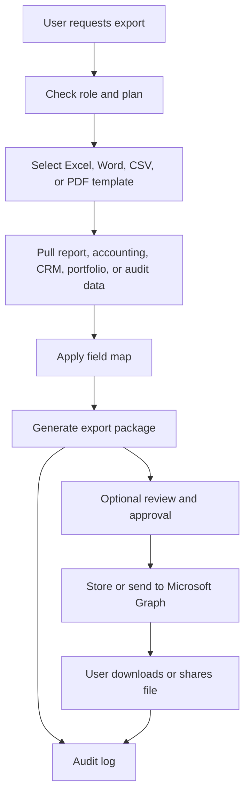

## 18. Feedback loops

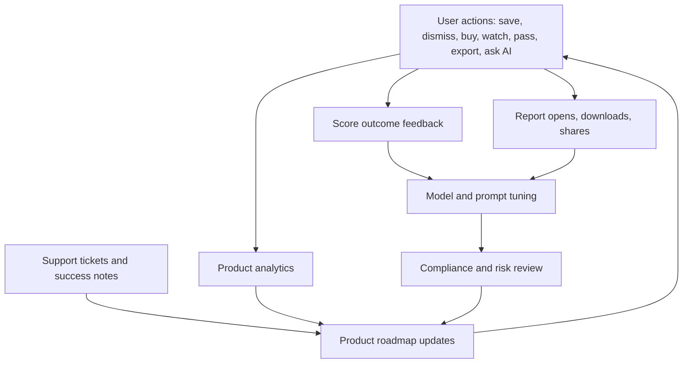

Feedback procedures:

1. Capture explicit and implicit user behavior.
2. Separate product analytics from regulated advice workflows.
3. Track score outcomes by asset class.
4. Route sensitive AI or recommendation changes through compliance review.
5. Update score factors, prompts, templates, and UI flows.

## 19. Interface protocol map

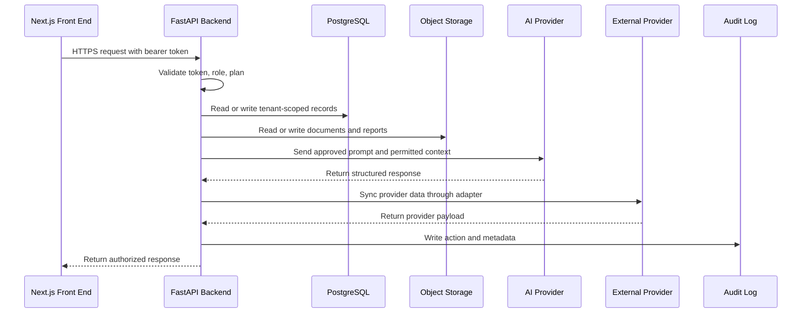

Protocol requirements:

- HTTPS only.
- Bearer token for protected backend routes.
- Organization ID on tenant-owned records.
- Secret references only for provider credentials.
- Webhook signature verification.
- Idempotency keys for billing and integration writes.
- Audit logs for sensitive reads, writes, exports, and syncs.

## 20. Data governance, audit, and compliance loop

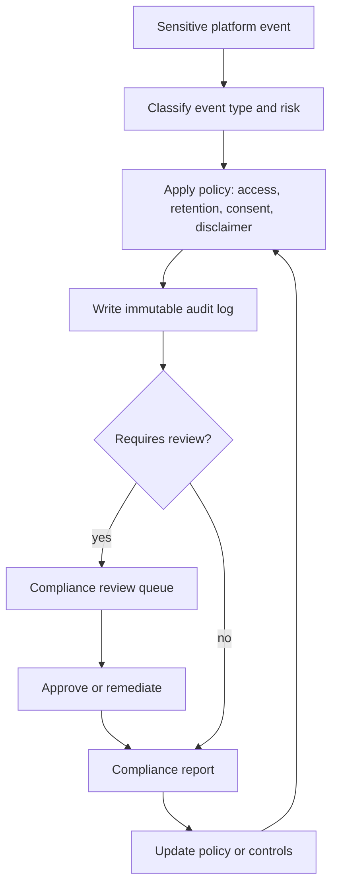

## 21. Admin and operations control loop

```mermaid
flowchart TD
  Admin["Admin console"]
  Users["User and organization management"]
  Billing["Subscription and revenue management"]
  Integrations["Integration health"]
  Jobs["Background job queues"]
  Logs["Audit logs and errors"]
  Support["Support tickets"]
  Metrics["KPIs and alerts"]
  Actions["Admin actions"]
  Audit["Audit admin actions"]

  Admin --> Users
  Admin --> Billing
  Admin --> Integrations
  Admin --> Jobs
  Admin --> Logs
  Admin --> Support
  Users --> Metrics
  Billing --> Metrics
  Integrations --> Metrics
  Jobs --> Metrics
  Logs --> Metrics
  Support --> Metrics
  Metrics --> Actions
  Actions --> Audit
```

## 22. Incident and exception flow

```mermaid
flowchart TD
  Detect["Detect exception: API error, failed sync, billing failure, security alert"]
  Classify["Classify severity"]
  Alert["Notify responsible team"]
  Triage["Triage root cause"]
  Contain["Contain customer or data impact"]
  Resolve["Resolve issue"]
  Communicate["Notify affected users if required"]
  Postmortem["Write incident report"]
  Improve["Add tests, alerts, runbooks, or controls"]

  Detect --> Classify
  Classify --> Alert
  Alert --> Triage
  Triage --> Contain
  Contain --> Resolve
  Resolve --> Communicate
  Resolve --> Postmortem
  Postmortem --> Improve
  Improve --> Detect
```

## 23. End-to-end business acquisition workflow

```mermaid
flowchart LR
  Lead["Deal lead"]
  CRM["CRM record"]
  Acquisition["Acquisition engine"]
  Score["Opportunity score"]
  Diligence["Due diligence center"]
  Finance["Financial model and SBA analysis"]
  Report["Diligence report"]
  Decision["Buy, watch, pass"]
  Capital["Capital raising or loan package"]
  Close["Close or archive"]

  Lead --> CRM
  CRM --> Acquisition
  Acquisition --> Score
  Score --> Diligence
  Diligence --> Finance
  Finance --> Report
  Report --> Decision
  Decision --> Capital
  Decision --> Close
  Capital --> Close
```

## 24. End-to-end investor research workflow

```mermaid
flowchart LR
  Question["Investor question"]
  Assistant["AI research assistant"]
  Market["Market and macro data"]
  Score["Opportunity score"]
  Portfolio["Portfolio context"]
  Output["Charts, risk score, recommendation"]
  Watchlist["Watchlist or portfolio action"]
  Report["Saved research report"]
  Feedback["User feedback"]

  Question --> Assistant
  Assistant --> Market
  Assistant --> Score
  Assistant --> Portfolio
  Market --> Output
  Score --> Output
  Portfolio --> Output
  Output --> Watchlist
  Output --> Report
  Watchlist --> Feedback
  Report --> Feedback
  Feedback --> Assistant
```

## 25. Full module dependency map

```mermaid
flowchart TB
  Auth["Auth and roles"]
  Billing["Billing and entitlements"]
  Data["Database and object storage"]
  Audit["Audit logs"]
  Dashboard["Dashboard"]
  Discovery["Investment discovery"]
  Acquisition["Business acquisition"]
  Diligence["Due diligence"]
  Macro["Macro intelligence"]
  Reports["Reports"]
  Assistant["AI assistant"]
  Portfolio["Portfolio"]
  Wealth["Wealth projection"]
  Governance["Governance"]
  Capital["Capital raising"]
  Score["Opportunity Score"]
  Accounting["Accounting and financial reporting"]
  CRM["CRM"]
  Integrations["External integrations"]
  Admin["Admin console"]

  Auth --> Dashboard
  Billing --> Dashboard
  Data --> Dashboard
  Audit --> Admin
  Dashboard --> Discovery
  Dashboard --> Portfolio
  Discovery --> Score
  Acquisition --> Score
  Score --> Diligence
  Macro --> Reports
  Assistant --> Reports
  Portfolio --> Wealth
  Governance --> Reports
  Capital --> CRM
  Accounting --> Reports
  CRM --> Dashboard
  Integrations --> Accounting
  Integrations --> Portfolio
  Integrations --> CRM
  Reports --> Admin
  Admin --> Audit
```

## Recommended next flowchart additions

- Add detailed database entity relationship diagram after all persistent tables are migrated.
- Add role-based access matrix by plan and user type.
- Add sequence diagrams for Stripe, Plaid, Microsoft Graph, and AI provider calls after production adapters are selected.
- Add data retention lifecycle diagram after legal retention policy is finalized.
- Add deployment architecture diagram after cloud provider is selected.
