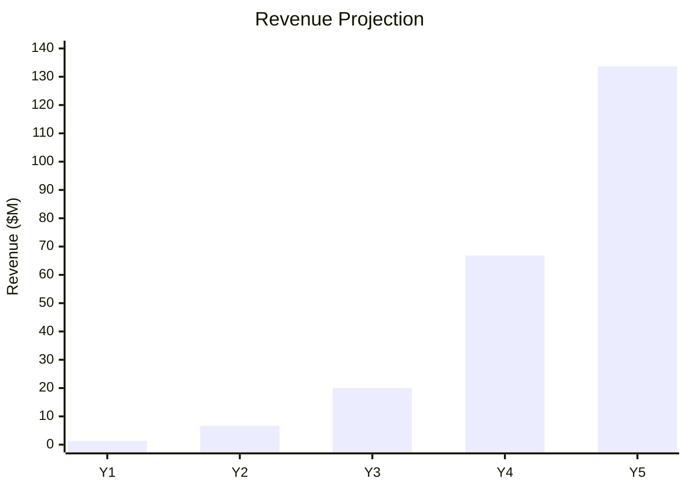
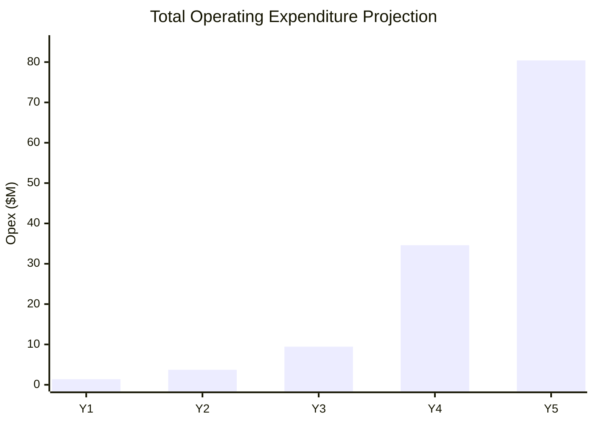
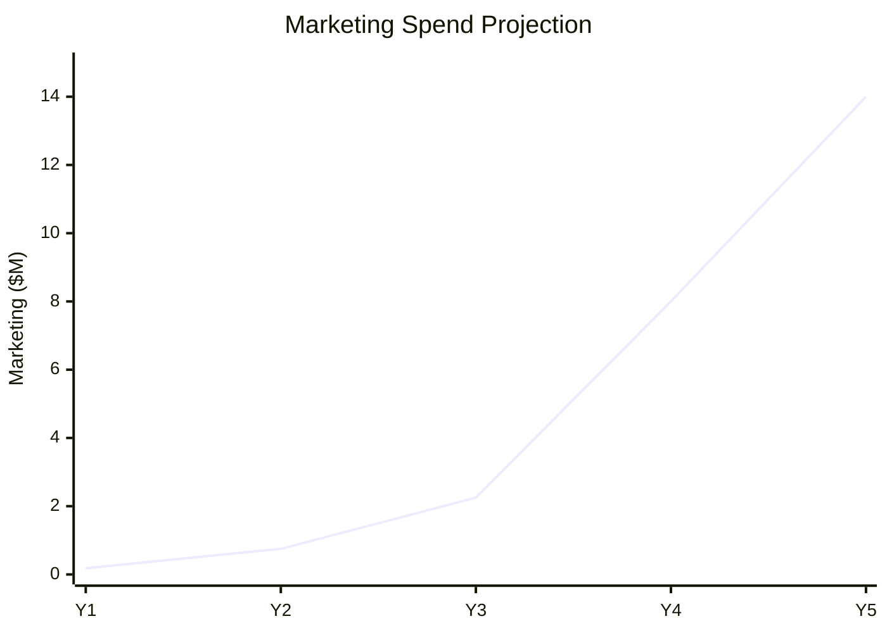
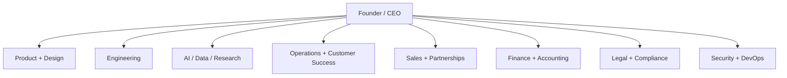

# John Henry Investments Financial Model and DCF

> JHI-SIG: 69M2705M · **INTERNAL** valuation & planning model (software publisher valuing its own
> platform). For internal planning, IP/software-asset valuation, and lending — **not** an offer or
> solicitation of investment.

## Purpose

This model converts the John Henry Investments platform assumptions into a five-year base-case financial model, including revenue projections, expenditure projections, marketing projections, staffing projections, EBITDA, free cash flow, and discounted cash flow valuation.

These are planning estimates only. They are not financial, accounting, tax, valuation, or investment advice.

## Source files

| File | Purpose |
| --- | --- |
| `model_assumptions.csv` | Pricing, mix, payment processing, discount rate, terminal growth |
| `financial_model_base_case.csv` | Full five-year base-case income/FCF schedule |
| `dcf_model.csv` | DCF model with free cash flow, terminal value, and estimated enterprise value |
| `revenue_projection.csv` | Chart-ready revenue and user projection data |
| `expenditure_projection.csv` | Chart-ready operating expenditure projection data |
| `marketing_projection.csv` | Chart-ready marketing spend, new users, and blended CAC |
| `staffing_projection.csv` | Chart-ready staffing and compensation/professional-services projection data |

## Base-case assumptions

| Assumption | Value |
| --- | ---: |
| Consumer price | $50/month |
| Professional price | $299/month |
| Enterprise price | $1,500/month |
| Consumer mix | 85% |
| Professional mix | 13% |
| Enterprise mix | 2% |
| Blended ARPU | $111.37/month |
| Payment processing estimate | 3.0% of revenue |
| Discount rate | 18.0% |
| Terminal growth rate | 3.0% |

## Five-year revenue projection

| Year | Users | Revenue |
| --- | ---: | ---: |
| Year 1 | 1,000 | $1.336M |
| Year 2 | 5,000 | $6.682M |
| Year 3 | 15,000 | $20.047M |
| Year 4 | 50,000 | $66.822M |
| Year 5 | 100,000 | $133.644M |

## Expenditure projection

| Year | Platform ops | Staffing/pro services | Legal/compliance | Marketing/sales | Payment processing | Total opex |
| --- | ---: | ---: | ---: | ---: | ---: | ---: |
| Year 1 | $120K | $960K | $84K | $180K | $40K | $1.384M |
| Year 2 | $480K | $2.100M | $180K | $750K | $200K | $3.710M |
| Year 3 | $1.200M | $4.800M | $600K | $2.250M | $601K | $9.451M |
| Year 4 | $4.800M | $18.000M | $1.800M | $8.000M | $2.005M | $34.605M |
| Year 5 | $11.400M | $45.600M | $5.400M | $14.000M | $4.009M | $80.409M |

## Marketing projection

| Year | Marketing/sales spend | New users | Estimated blended CAC |
| --- | ---: | ---: | ---: |
| Year 1 | $180K | 1,000 | $180 |
| Year 2 | $750K | 4,000 | $188 |
| Year 3 | $2.250M | 10,000 | $225 |
| Year 4 | $8.000M | 35,000 | $229 |
| Year 5 | $14.000M | 50,000 | $280 |

## Staffing and professional services projection

| Year | Estimated headcount low | Estimated headcount high | Staffing/pro services |
| --- | ---: | ---: | ---: |
| Year 1 | 3 | 7 | $960K |
| Year 2 | 8 | 15 | $2.100M |
| Year 3 | 20 | 45 | $4.800M |
| Year 4 | 75 | 160 | $18.000M |
| Year 5 | 150 | 350 | $45.600M |

## EBITDA projection

| Year | Revenue | Total opex | EBITDA | EBITDA margin |
| --- | ---: | ---: | ---: | ---: |
| Year 1 | $1.336M | $1.384M | ($48K) | -3.6% |
| Year 2 | $6.682M | $3.710M | $2.972M | 44.5% |
| Year 3 | $20.047M | $9.451M | $10.595M | 52.9% |
| Year 4 | $66.822M | $34.605M | $32.217M | 48.2% |
| Year 5 | $133.644M | $80.409M | $53.235M | 39.8% |

## Discounted cash flow model

| Year | EBITDA | Cash taxes | Capex | Change in working capital | Free cash flow | PV of FCF |
| --- | ---: | ---: | ---: | ---: | ---: | ---: |
| Year 1 | ($48K) | $0 | $67K | $27K | ($141K) | ($120K) |
| Year 2 | $2.972M | $624K | $334K | $107K | $1.907M | $1.369M |
| Year 3 | $10.595M | $2.225M | $1.002M | $267K | $7.101M | $4.322M |
| Year 4 | $32.217M | $6.766M | $3.341M | $936K | $21.175M | $10.922M |
| Year 5 | $53.235M | $11.179M | $6.682M | $1.336M | $34.037M | $14.878M |

DCF assumptions and result:

| Metric | Value |
| --- | ---: |
| Discount rate | 18.0% |
| Terminal growth rate | 3.0% |
| Terminal value | $233.719M |
| PV terminal value | $102.161M |
| Estimated enterprise value | $133.532M |

## Investor interpretation

- The model becomes EBITDA-positive in Year 2 under the base case.
- Staffing and marketing are the largest controllable expenditure lines.
- Year 5 EBITDA margin remains below the earlier platform-only EBITDA model because this model includes heavier staffing and marketing.
- DCF value is materially below the blue-sky ARR multiple valuation because this model uses explicit discounted cash flow and a high discount rate.
- Upside exists if enterprise pricing increases, AI/document usage is capped, acquisition cost is lower, or enterprise customers pay annually.

## Recommended additions for investor diligence

- Add churn assumptions and net revenue retention.
- Add customer acquisition cost by channel.
- Add gross margin by plan.
- Add deferred revenue and annual prepayment effects.
- Add sales pipeline conversion model.
- Add sensitivity cases for discount rate, terminal growth, churn, and ARPU.
- Add separate enterprise pricing scenarios at $2,500, $5,000, and $10,000/month.
