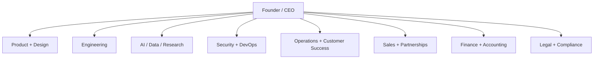

# John Henry Investments — Company & Platform Overview (Internal)

> JHI-SIG: 69M2705M · **INTERNAL by default.** Company & platform overview for JHI Research &
> Analytics Firm, Inc. (a **software publisher** building research platforms). Used for internal
> planning, valuation, and lending. **Not** a current offer or solicitation of investment. Materials
> retained so the Board keeps the *option* to present them for an outside opportunity if it ever elects.

## Overview purpose

Internal, slide-by-slide overview of the John Henry Investments research & analytics SaaS platform
(company, product, model, and valuation) — retained for internal use and optional external presentation.

Companion files:

- `JOHN_HENRY_INVESTMENTS_PITCH_DECK.pptx`
- `FINANCIAL_MODEL_DCF.md`
- `financial_model_base_case.csv`
- `dcf_model.csv`
- `revenue_projection.csv`
- `expenditure_projection.csv`
- `marketing_projection.csv`
- `staffing_projection.csv`

## Slide 1 - Title

John Henry Investments Platform

AI-powered investment intelligence, business acquisition analysis, due diligence, macro research, portfolio management, accounting workflows, CRM, and financial reporting.

## Slide 2 - Problem

Investors, business buyers, family offices, and professional advisors use disconnected tools for:

- Market research
- Acquisition discovery
- Due diligence
- Portfolio tracking
- Accounting and audit reporting
- CRM and capital raising
- AI-assisted decision support

The result is slower decisions, fragmented data, inconsistent risk analysis, and missed opportunities.

## Slide 3 - Solution

John Henry Investments is building a subscription platform that combines:

- AI opportunity discovery
- John Henry Opportunity Score
- Business acquisition engine
- AI due diligence center
- Macro intelligence center
- Portfolio management
- Accounting, audit, and financial reporting backend
- CRM and integration workflows

## Slide 4 - Market opportunity

Target customers:

- Retail investors
- Accredited investors
- Acquisition entrepreneurs
- Family offices
- Investment firms
- CPAs
- Attorneys
- Bankers

The platform starts as SaaS and can expand into a family office operating system and business acquisition intelligence network.

## Slide 5 - Product modules

Current and planned modules:

1. User management
2. Dashboard
3. Investment discovery engine
4. Business acquisition engine
5. AI due diligence center
6. Global macro dashboard
7. Weekly intelligence reports
8. AI research assistant
9. Portfolio tracking
10. Wealth projection engine
11. Corporate governance center
12. Capital raising center
13. John Henry Opportunity Score
14. Accounting, audit, financial reports, CRM, and integrations backend

## Slide 6 - Current platform build

Current repository includes:

- Next.js and TypeScript front end
- FastAPI backend
- Authentication/database/billing foundation
- Accounting and trial balance APIs
- Audit and financial report APIs
- CRM APIs
- Banking/vendor/Microsoft Office/CRM integration interfaces
- Documentation, cost model, capacity model, EBITDA model, staffing pro forma

## Slide 7 - Revenue model

| Plan | Price | Target customer |
| --- | ---: | --- |
| Consumer | $50/month | Retail investors and wealth builders |
| Professional | $299/month | Acquisition entrepreneurs and advisors |
| Enterprise / Family Office | $1,500+/month | Family offices, firms, CPAs, attorneys, bankers |

Revenue expansion opportunities:

- Annual plans
- Enterprise integrations
- Branded reports
- Due diligence document analysis
- API access
- White-label reporting

## Slide 8 - Revenue projection chart

Base-case blended mix:

- 85% Consumer
- 13% Professional
- 2% Enterprise
- Blended ARPU: $111.37/month

| Year | Users | Revenue |
| --- | ---: | ---: |
| Year 1 | 1,000 | $1.336M |
| Year 2 | 5,000 | $6.682M |
| Year 3 | 15,000 | $20.047M |
| Year 4 | 50,000 | $66.822M |
| Year 5 | 100,000 | $133.644M |

## Slide 9 - Expenditure projection chart

| Year | Total opex |
| --- | ---: |
| Year 1 | $1.384M |
| Year 2 | $3.710M |
| Year 3 | $9.451M |
| Year 4 | $34.605M |
| Year 5 | $80.409M |

Key expenditure categories:

- Platform operations
- Staffing and professional services
- Legal and compliance
- Marketing and sales
- Payment processing

## Slide 10 - Marketing projection chart

| Year | Marketing spend | New users | Blended CAC |
| --- | ---: | ---: | ---: |
| Year 1 | $180K | 1,000 | $180 |
| Year 2 | $750K | 4,000 | $188 |
| Year 3 | $2.250M | 10,000 | $225 |
| Year 4 | $8.000M | 35,000 | $229 |
| Year 5 | $14.000M | 50,000 | $280 |

## Slide 11 - EBITDA projection

| Year | Revenue | EBITDA | EBITDA margin |
| --- | ---: | ---: | ---: |
| Year 1 | $1.336M | ($48K) | -3.6% |
| Year 2 | $6.682M | $2.972M | 44.5% |
| Year 3 | $20.047M | $10.595M | 52.9% |
| Year 4 | $66.822M | $32.217M | 48.2% |
| Year 5 | $133.644M | $53.235M | 39.8% |

## Slide 12 - Discounted cash flow model

| Metric | Value |
| --- | ---: |
| Discount rate | 18.0% |
| Terminal growth | 3.0% |
| Year 5 FCF | $34.037M |
| Terminal value | $233.719M |
| PV terminal value | $102.161M |
| Estimated enterprise value | $133.532M |

## Slide 13 - Personnel hierarchy



## Slide 14 - Staffing projection

| Year | Low headcount | High headcount | Staffing/pro services |
| --- | ---: | ---: | ---: |
| Year 1 | 3 | 7 | $960K |
| Year 2 | 8 | 15 | $2.100M |
| Year 3 | 20 | 45 | $4.800M |
| Year 4 | 75 | 160 | $18.000M |
| Year 5 | 150 | 350 | $45.600M |

## Slide 15 - Competitive advantage

Defensible assets:

- John Henry Opportunity Score
- AI Due Diligence Engine
- Business Acquisition Intelligence Platform
- Proprietary user interaction and diligence data
- Integrated financial, CRM, accounting, and report workflows
- Enterprise-ready integrations and document workflows

## Slide 16 - Go-to-market

Phased GTM:

1. Founder-led controlled beta
2. Professional acquisition entrepreneur launch
3. Advisor/CPA/attorney referral partnerships
4. Family office and enterprise pilots
5. Consumer subscription scale after product proof

Recommended first segment:

```text
Professional users and acquisition entrepreneurs because ARPU is higher and the acquisition/diligence value proposition is clearer.
```

## Slide 17 - Risk controls

Controls required before broad launch:

- Legal review of financial disclaimers
- Privacy policy and terms of service
- AI-output disclaimers
- Role-based access control
- Secure document storage
- Bank/vendor integration consent
- Audit logs
- Payment webhook verification
- Human-review process for high-risk outputs

## Slide 18 - Use of funds

Recommended MVP use of funds:

- Product engineering
- Database and infrastructure
- AI/scoring engine
- Stripe billing integration
- Document upload and due diligence workflows
- Legal/compliance review
- Security review
- Initial customer acquisition
- Customer support and operations

## Slide 19 - Recommended investor ask structure

Potential raise structure to define:

- Amount to raise
- Instrument: SAFE, convertible note, priced equity, or strategic investment
- Runway target
- Milestones funded
- Governance rights
- Use-of-funds allocation

Recommendation:

```text
Define the raise around milestones, not only valuation: production MVP, first paid customers, compliance package, integrations, and AI scoring engine.
```

## Slide 20 - Additional recommended slides

Recommended additions not originally requested:

- Churn and retention assumptions
- Customer acquisition channels
- Pipeline and pilot customer status
- Compliance roadmap
- Data moat and proprietary score methodology
- Product screenshots
- Competitive landscape
- Customer testimonials or discovery quotes
- Milestone-based use of funds
- Exit/acquirer landscape
- Risk disclosure slide

## Slide 21 - Closing

John Henry Investments Platform aims to become an investment intelligence, business acquisition, and family office operating system powered by AI, proprietary scoring, integrated reporting, and financial workflow automation.

Next investor-ready action:

```text
Convert assumptions into live spreadsheet model, confirm legal/compliance position, add product screenshots, define pilot customers, and finalize use-of-funds ask.
```
