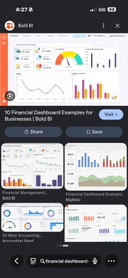
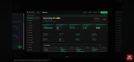
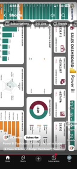
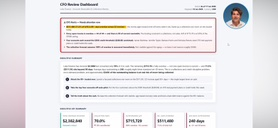
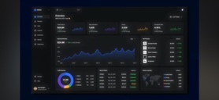
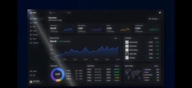

# Dashboard visual language — filed references (2026-08-30)

**Filed by:** Cy Henry (VP Software Engineering — AI) at Founder direction, 2026-08-30
**Filed under:** `docs/references/dashboards/`
**Anchored in:** `docs/board/BOARD_MINUTES_2026-08-26.md` §8 (institutional dashboards)
**Companion:** `docs/CROSS_ASSET_DISTRIBUTION_CONSTRUCT.md` (newsletter visual layer)
**JHI-SIG:** 69M2705M

---

## Founder directive (verbatim)

> *"Cy please file these examples of dashboards. This is what we should be building and adding in our platform. I believe this is of value. Even to the point of incorporating this into our news letters to provide a narrative of topic discussion with a display of actual findings based on data polled."*

**Interpretation adopted for the build:**
1. Adopt these visual conventions as the **house dashboard language** across Aegira's platform modules — Home, Dashboard, Portfolio (per-ticker), Economics, Valuation, QoE / Diligence, Reports.
2. Extend the **same** visual language into every newsletter edition so subscribers see the **narrative + the actual findings from polled data** side-by-side, not narrative in isolation.

---

## The six filed references

### Reference 01 — Bold BI financial-dashboard catalog *(browse view)*



**Source:** Google search result thumbnail — *10 Financial Dashboard Examples for Businesses* (Bold BI).
**What to notice:** the catalog shows the **spread of institutional dashboard archetypes**: gauge-plus-bars overview, product/segment stacked bar, KPI-tile grid, categorical column charts. It's a **taxonomy exhibit** — a reminder that a single "dashboard" style does not cover the range of decisions a Tier 1/2 buyer makes.

**Adopted for the build:**
- Ensures we don't build a single template. Each Aegira module gets the archetype that fits the decision:
  - **Home / Dashboard** → KPI-tile grid + status roll-up (archetype: exec overview).
  - **Portfolio (per-ticker)** → filled line chart + doughnut segmentation + KPI strip (archetype: security screen).
  - **QoE / Diligence** → alerting header + KPI tile bar + exec-avatar attribution (archetype: CFO review).
  - **Economics** → time-series line + regime quadrant + heat map (archetype: macro monitor).

---

### Reference 02 — Trading overview with KPI strip *(dark theme)*



**What to notice:**
- **Prominent status header** (green badge — "outperforming, Wed").
- **Five-tile KPI strip** immediately below the header: dollar figure, count, percentage, ratio, coefficient — one glance conveys the entire read.
- **Data table** below the KPIs — the record-level backup for the same period.
- **Dark palette** — reduces glare during long analyst sessions.
- **Fixed sidebar navigation** — module TOC left, workspace right (matches our existing app-shell pattern).

**Adopted for the build:**
- **Home** and **Dashboard** modules get a **status header + 5-tile KPI strip + first-drill table** as their canonical layout.
- **Portfolio → ticker page** gets the same strip: Price · Δ Day · Δ Week · Δ Month · 1-yr sparkline.
- **Newsletter Insider Briefs** — top of each brief carries a KPI strip auto-derived from the polled data for that edition period (e.g. SPX return, VIX close, US-2Y, DXY, WTI).

---

### Reference 03 — Power BI sales dashboard *(mobile, color-blocked)*



**What to notice:**
- **Color-blocked tiles** (green subscriptions, red trends, muted totals) — the eye is directed to the anomalies, not the totals.
- **Mobile-first layout** — vertical stack of self-contained blocks, none reliant on hover state.
- **Explicit "Subscribe" CTA** wedged between the analytics tiles — a business-model reminder that even the dashboard is a conversion surface.

**Adopted for the build:**
- **Mobile companion / responsive layouts** — the platform is unusable on a phone today. This is the target layout for `/mobile` and for narrow-viewport rendering on `/dashboard`.
- **Anomaly-forward color rule** — Red / Amber / Green usage is reserved for **status flags**, never decorative — matches the Ratio Dashboard `Status` column shipped in [PR #188](https://github.com/marcellmiller27/marcellmiller27/pull/188).
- **Business-model surface** — every dashboard on the free/preview surface embeds a subtle upgrade prompt inline (Tier 1 / 2 CTA) rather than in a corner.

---

### Reference 04 — CFO Review Dashboard *(light theme, alerts + exec attribution)*



**What to notice:**
- **Alerting header block** at the top — a red-bordered box carrying **prioritized findings in plain English**, not raw numbers. This is the "if you read one thing" section.
- **Executive avatar + attribution** upper-right — a human name behind the analysis.
- **Analysis prose** in the body — sentences, not just charts, explaining what the numbers mean.
- **KPI-strip footer** — five headline numbers: dollar total, percent, dollar, dollar, days.

**Adopted for the build — this is the highest-value reference for Aegira:**
- **QoE / Diligence deliverables** get this exact layout: alerting header (materiality flags from PR #188's bridge), exec attribution ("Prepared by Ellery Vance / VP Editorial · reviewed by Cy Henry / VP Engineering"), plain-English findings, then the numeric detail.
- **Findings & Recommended Actions cover section** (§10.8 doctrine from board minutes) is exactly this alerting header + prose pattern — the P1 follow-up in the work group already lists it.
- **Newsletter Insider Briefs** — every edition opens with a red/amber/green "read this first" callout tied to that edition's polled data.
- **Attribution is non-negotiable** — every deliverable and every newsletter must carry the AI VP's avatar + name so subscribers know a persona owns the analysis (Ellery Vance for editorial; Cy Henry for engineering; Vance Ashworth for financial; etc.). Removes the "who wrote this" question that erodes Tier 1/2 trust.

---

### Reference 05 — Overview dashboard with filled line chart + doughnut *(dark)*



**What to notice:**
- **Big, single, filled area line chart** dominates the workspace — one hero visualization, not four small ones fighting for attention.
- **Doughnut breakdown** to the right — instantly shows the compositional split behind the line.
- **Muted color palette** — one dominant hue (teal/cyan) with categorical accents (green / orange / pink) reserved for the doughnut.
- **KPI tiles above** carry supporting context — dollar total, growth %, additional metrics.
- **Sidebar TOC on the left** — same shell language we already ship.

**Adopted for the build:**
- **Home** and **Dashboard** hero region gets a **filled-area line chart + companion doughnut** for whatever the "one number that matters" is — for a subscriber: their portfolio value with sector-breakdown doughnut; for an admin: revenue with tier-breakdown doughnut.
- **Portfolio → per-ticker page** — replace the current small-multiples layout with a single hero filled line chart of the ticker's 1-year price + a doughnut for allocation (if held) or peer weighting.
- **Newsletter Economic Brief** — every regime section gets a hero filled line + composition doughnut (e.g. GDP by contribution, CPI by component, deficit by category). Ties directly to the existing `backend/app/newsletter_charts.py` — extend to add the filled-area + doughnut variants.

---

### Reference 06 — Overview dashboard, full workspace *(dark, tables + world map)*



**What to notice:** the same design language as reference 05, but with the workspace fully populated:
- **Right-side tables** — sortable data rows (ticker-style) with sparklines per row.
- **World map** with data overlay (heat / bubbles) — spatial context added inline.
- **Every tile has a supporting mini-widget** rather than a bare number.
- **Consistent header + sidebar** as reference 05 — proves the layout language scales from "hero + one detail" to "hero + four details" without redesign.

**Adopted for the build:**
- **Portfolio → holdings table** — sortable, with sparkline per row, matching this table style.
- **Newsletter Cross-Asset Opportunity Scan** — the world-map + regional heat overlay is exactly right for "where in the world is the opportunity this month" — feeds directly from FRED / EIA / OECD DATA_GOV series.
- **Economics module** — the world-map cell should be a real component (US map for state-level FDIC / BLS data; world map for OECD / IMF / EIA series).

---

## Design-language inventory (extracted from all six references)

The building blocks Aegira commits to across every module and every newsletter:

| Building block | Reference(s) | Where it lands |
|---|---|---|
| Fixed left sidebar TOC (icon + label) | 02, 05, 06 | Already shipped in app-shell |
| Status-badge header (green/amber/red pill + short verb) | 02, 04 | `AppShell` hero; QoE Cover; Insider Brief lede |
| 5-tile KPI strip (hero → detail) | 02, 04, 05, 06 | Home; Dashboard; Portfolio ticker; every newsletter edition top |
| Alerting header block (red-bordered plain-English findings) | 04 | QoE / Diligence cover; Insider Brief top block |
| Executive avatar + persona attribution | 04 | Every deliverable + every newsletter byline |
| Hero filled-area line chart (single, dominant) | 05, 06 | Home hero; Portfolio ticker page; every newsletter section lede chart |
| Companion doughnut / composition ring | 05, 06 | Beside every hero line chart |
| Sortable data table with per-row sparkline | 06 | Portfolio holdings; Newsletter Opportunity Scan rankings |
| World / US map with data overlay | 06 | Economics module; Newsletter regional sections |
| Anomaly-first color rule (green/amber/red = status only) | 03, 04 | Already codified in `ratio_dashboard.py` + `qoe_bridge_workbook.py` (PR #188); extend to every UI surface |
| Mobile-first vertical stack | 03 | `/mobile` route + narrow-viewport rules on `/dashboard` |
| Inline conversion CTA on preview surfaces | 03 | Storefront / free-preview newsletter pages |

---

## Platform build mapping

| Aegira module | Adopted references | Concrete build |
|---|---|---|
| **Home** (story of Aegira) | 02, 05 | Status-badge header + 5-tile KPI strip + hero filled-area line + companion doughnut. Numbers polled from the same data foundation the app already uses. |
| **Dashboard** (launchpad) | 02, 04, 05 | Status-badge header + 5-tile KPI strip + alerting-header block ("if you read one thing today") + module tiles. |
| **Portfolio → per-ticker page** | 02, 05, 06 | 5-tile KPI strip (Price · Δ Day · Δ Week · Δ Month · 1-yr) + hero filled-area line + companion doughnut (sector or fundamentals composition) + sortable ratios table (feeds from the P1 Ratio Dashboard shipped in [PR #188](https://github.com/marcellmiller27/marcellmiller27/pull/188)). |
| **Portfolio → holdings** | 06 | Sortable table with sparkline per row + world-map (regional exposure). |
| **QoE / Diligence** | 04 | Alerting header (materiality flags from `qoe_bridge`) + exec-attribution avatar + plain-English Findings & Recommended Actions + KPI-strip footer (reported / adjusted seller / adjusted buyer / LTM / run-rate). |
| **Economics** | 05, 06 | Hero filled-area line for the featured series + doughnut breakdown + world/US map for spatial series (FDIC by state, EIA by state, OECD by country). |
| **Valuation** | 02, 05 | Status-badge header (Enter / Accumulate / Sideline) + 5-tile KPI strip (Price · Fair Value · IRR · Margin of Safety · Signal) + hero filled-area of implied fair-value vs. market. |
| **Reports** | 04 | Alerting header + exec attribution + report cards (already shipped) + KPI-strip preview per card. |
| **Mobile / narrow viewport** | 03 | Vertical color-blocked tile stack + inline CTAs. |

---

## Newsletter build mapping (the Founder's second half — narrative + polled findings)

Every edition adopts a **standard opening layout** so subscribers get the same visual language across editions:

```
[Executive avatar]  [Persona byline]                         [Publication date · edition #]

[Status-badge header — 1 sentence read]

[Alerting block — 2-3 red/amber/green bullets: "what changed since last edition"]

[5-tile KPI strip — the numbers behind the header, from polled data]

[Editor's letter — narrative]           [Hero filled-area line chart]
                                        [Companion doughnut]

[Section 1: heading]
  [narrative prose]                     [chart supporting the narrative]

[Section 2: heading]
  ...
```

**Per-edition specifics:**

| Edition | Adopted references | Concrete layout addition |
|---|---|---|
| **Economic Brief** | 04, 05, 06 | Alerting block ("watch this week"), 5-tile KPI strip (Fed Funds · CPI · Unemp · GDP · 10Y), hero filled-area line for the featured macro series, US map for state/regional series (retail sales, employment, delinquencies by state). |
| **Insider Briefs** | 02, 04, 05 | Status-badge header (regime label), alerting block (materiality changes across watched signals), hero filled-area + doughnut for cross-asset regime, per-section narrative + supporting chart. |
| **Opportunity Scan** | 06 | Sortable ranked table with per-row sparkline (already fits Reference 06's "table + sparkline" pattern), world-map heat for regional opportunity density, per-ticker deep-dive drills that reuse the per-ticker page's KPI strip + line + doughnut. |
| **Red Alerts** | 04 | Alerting header dominates the top of the edition; each alert has its own KPI strip + supporting chart. |
| **Crypto Intelligence** | 05, 06 | Hero filled-area (BTC or asset-featured), doughnut (market-cap split), sortable table (top movers), regional exchange-volume world map. |
| **Dividend Opportunities** | 06 | Sortable ranked table with yield / payout / coverage per row + per-row sparkline for 5-yr yield. |
| **Main Street Acquirer** | 04, 06 | Alerting header (SBA rate change, industry-resilience score change) + KPI strip (median deal size / median multiple / SBA rate / lending volume / recession-resilience %) + sortable table of segments with resilience-score bars. |

**Backend touchpoints (already exist, extending is straightforward):**
- `backend/app/newsletter_charts.py` — add filled-area, doughnut, and US/world map renderers. Regime quadrant + signal heatmap already exist.
- `backend/app/newsletter_content.py` — extend `EditorLetter` / `Edition` dataclasses with `alerting_block`, `kpi_strip`, `hero_chart` fields.
- `src/components/newsletter-edition.tsx` — extend the renderer to display alerting block + KPI strip + hero chart on top of every edition.

---

## Governance & implementation phasing

**P1 (this doc adopts the language; build lands in follow-up PRs):**
1. Extend `backend/app/newsletter_charts.py` with `filled_area_chart()`, `donut_chart()`, `us_state_map()`, `world_map()` renderers.
2. Extend `backend/app/newsletter_content.py` `Edition` dataclass with `alerting_block: list[AlertLine]`, `kpi_strip: list[KPITile]`, `hero_chart: ChartSpec | None`.
3. Extend `src/components/newsletter-edition.tsx` to render alerting block + KPI strip + hero chart at the top of every edition.
4. Adopt the QoE / Diligence layout (reference 04) as the Findings & Recommended Actions cover section (already in work group as a P1 follow-up on PR #188).

**P2 (platform surfaces):**
5. Redo `/home` hero using the reference-05 layout.
6. Redo `/dashboard` launchpad with the reference-02 KPI-strip and reference-04 alerting header.
7. Redo `/portfolio/[ticker]` per-ticker page with the reference-05 hero-line + doughnut + reference-06 ratios table (feeds from the P1 Ratio Dashboard already shipped).

**P3 (mobile + spatial data):**
8. Redo `/mobile` with reference-03's vertical color-blocked stack.
9. Add world/US-map component to `Economics` and `Opportunity Scan`.

**Non-negotiables (from PR #188 governance carry-over):**
- Anomaly-first color rule enforced by `sector_profiles.Status`; no decorative red/amber/green anywhere.
- Every deliverable + every newsletter carries the exec avatar + persona byline + `JHI-SIG: 69M2705M`.
- Data underlying every KPI tile / chart carries its as-of / cadence / freshness (Data Foundation doctrine already shipped).
- Newsletter text stays fact-locked (E2 LLM elevation only rephrases prose; numbers never sent to model).

---

*Filed by Cy Henry, VP Software Engineering (AI). JHI-SIG: 69M2705M. Reference images stored under `docs/references/dashboards/`. This filing adopts the visual language; the build lands in follow-up PRs per the phasing above. How we do anything is how we do everything. TeamWork makes the DreamWork.*
