# Dashboard visual language — filed references (2026-08-30)

**Filed by:** Cy Henry (VP Software Engineering — AI) at Founder direction, 2026-08-30
**Filed under:** `docs/references/dashboards/`
**Anchored in:** `docs/board/BOARD_MINUTES_2026-08-26.md` §8 (institutional dashboards)
**Companion:** `docs/CROSS_ASSET_DISTRIBUTION_CONSTRUCT.md` (newsletter visual layer)
**JHI-SIG:** 69M2705M

---

## Founder directive (verbatim)

> *"Cy please file these examples of dashboards. This is what we should be building and adding in our platform. I believe this is of value. Even to the point of incorporating this into our news letters to provide a narrative of topic discussion with a display of actual findings based on data polled."*

**Interpretation adopted for the build:**
1. Adopt these visual conventions as the **house dashboard language** across Aegira's platform modules — Home, Dashboard, Portfolio (per-ticker), Economics, Valuation, QoE / Diligence, Reports.
2. Extend the **same** visual language into every newsletter edition so subscribers see the **narrative + the actual findings from polled data** side-by-side, not narrative in isolation.

---

## Filed references (11 total: 6 initial + 5 added later on 2026-08-30)

### Reference 01 — Bold BI financial-dashboard catalog *(browse view)*


**Source:** Google search result thumbnail — *10 Financial Dashboard Examples for Businesses* (Bold BI).
**What to notice:** the catalog shows the **spread of institutional dashboard archetypes**: gauge-plus-bars overview, product/segment stacked bar, KPI-tile grid, categorical column charts. It's a **taxonomy exhibit** — a reminder that a single "dashboard" style does not cover the range of decisions a Tier 1/2 buyer makes.

**Adopted for the build:**
- Ensures we don't build a single template. Each Aegira module gets the archetype that fits the decision:
  - **Home / Dashboard** → KPI-tile grid + status roll-up (archetype: exec overview).
  - **Portfolio (per-ticker)** → filled line chart + doughnut segmentation + KPI strip (archetype: security screen).
  - **QoE / Diligence** → alerting header + KPI tile bar + exec-avatar attribution (archetype: CFO review).
  - **Economics** → time-series line + regime quadrant + heat map (archetype: macro monitor).

---

### Reference 02 — Trading overview with KPI strip *(dark theme)*


**What to notice:**
- **Prominent status header** (green badge — "outperforming, Wed").
- **Five-tile KPI strip** immediately below the header: dollar figure, count, percentage, ratio, coefficient — one glance conveys the entire read.
- **Data table** below the KPIs — the record-level backup for the same period.
- **Dark palette** — reduces glare during long analyst sessions.
- **Fixed sidebar navigation** — module TOC left, workspace right (matches our existing app-shell pattern).

**Adopted for the build:**
- **Home** and **Dashboard** modules get a **status header + 5-tile KPI strip + first-drill table** as their canonical layout.
- **Portfolio → ticker page** gets the same strip: Price · Δ Day · Δ Week · Δ Month · 1-yr sparkline.
- **Newsletter Insider Briefs** — top of each brief carries a KPI strip auto-derived from the polled data for that edition period (e.g. SPX return, VIX close, US-2Y, DXY, WTI).

---

### Reference 03 — Power BI sales dashboard *(mobile, color-blocked)*


**What to notice:**
- **Color-blocked tiles** (green subscriptions, red trends, muted totals) — the eye is directed to the anomalies, not the totals.
- **Mobile-first layout** — vertical stack of self-contained blocks, none reliant on hover state.
- **Explicit "Subscribe" CTA** wedged between the analytics tiles — a business-model reminder that even the dashboard is a conversion surface.

**Adopted for the build:**
- **Mobile companion / responsive layouts** — the platform is unusable on a phone today. This is the target layout for `/mobile` and for narrow-viewport rendering on `/dashboard`.
- **Anomaly-forward color rule** — Red / Amber / Green usage is reserved for **status flags**, never decorative — matches the Ratio Dashboard `Status` column shipped in [PR #188](https://github.com/marcellmiller27/marcellmiller27/pull/188).
- **Business-model surface** — every dashboard on the free/preview surface embeds a subtle upgrade prompt inline (Tier 1 / 2 CTA) rather than in a corner.

---

### Reference 04 — CFO Review Dashboard *(light theme, alerts + exec attribution)*


**What to notice:**
- **Alerting header block** at the top — a red-bordered box carrying **prioritized findings in plain English**, not raw numbers. This is the "if you read one thing" section.
- **Executive avatar + attribution** upper-right — a human name behind the analysis.
- **Analysis prose** in the body — sentences, not just charts, explaining what the numbers mean.
- **KPI-strip footer** — five headline numbers: dollar total, percent, dollar, dollar, days.

**Adopted for the build — this is the highest-value reference for Aegira:**
- **QoE / Diligence deliverables** get this exact layout: alerting header (materiality flags from PR #188's bridge), exec attribution ("Prepared by Ellery Vance / VP Editorial · reviewed by Cy Henry / VP Engineering"), plain-English findings, then the numeric detail.
- **Findings & Recommended Actions cover section** (§10.8 doctrine from board minutes) is exactly this alerting header + prose pattern — the P1 follow-up in the work group already lists it.
- **Newsletter Insider Briefs** — every edition opens with a red/amber/green "read this first" callout tied to that edition's polled data.
- **Attribution is non-negotiable** — every deliverable and every newsletter must carry the AI VP's avatar + name so subscribers know a persona owns the analysis (Ellery Vance for editorial; Cy Henry for engineering; Vance Ashworth for financial; etc.). Removes the "who wrote this" question that erodes Tier 1/2 trust.

---

### Reference 05 — Overview dashboard with filled line chart + doughnut *(dark)*


**What to notice:**
- **Big, single, filled area line chart** dominates the workspace — one hero visualization, not four small ones fighting for attention.
- **Doughnut breakdown** to the right — instantly shows the compositional split behind the line.
- **Muted color palette** — one dominant hue (teal/cyan) with categorical accents (green / orange / pink) reserved for the doughnut.
- **KPI tiles above** carry supporting context — dollar total, growth %, additional metrics.
- **Sidebar TOC on the left** — same shell language we already ship.

**Adopted for the build:**
- **Home** and **Dashboard** hero region gets a **filled-area line chart + companion doughnut** for whatever the "one number that matters" is — for a subscriber: their portfolio value with sector-breakdown doughnut; for an admin: revenue with tier-breakdown doughnut.
- **Portfolio → per-ticker page** — replace the current small-multiples layout with a single hero filled line chart of the ticker's 1-year price + a doughnut for allocation (if held) or peer weighting.
- **Newsletter Economic Brief** — every regime section gets a hero filled line + composition doughnut (e.g. GDP by contribution, CPI by component, deficit by category). Ties directly to the existing `backend/app/newsletter_charts.py` — extend to add the filled-area + doughnut variants.

---

### Reference 06 — Overview dashboard, full workspace *(dark, tables + world map)*


**What to notice:** the same design language as reference 05, but with the workspace fully populated:
- **Right-side tables** — sortable data rows (ticker-style) with sparklines per row.
- **World map** with data overlay (heat / bubbles) — spatial context added inline.
- **Every tile has a supporting mini-widget** rather than a bare number.
- **Consistent header + sidebar** as reference 05 — proves the layout language scales from "hero + one detail" to "hero + four details" without redesign.

**Adopted for the build:**
- **Portfolio → holdings table** — sortable, with sparkline per row, matching this table style.
- **Newsletter Cross-Asset Opportunity Scan** — the world-map + regional heat overlay is exactly right for "where in the world is the opportunity this month" — feeds directly from FRED / EIA / OECD DATA_GOV series.
- **Economics module** — the world-map cell should be a real component (US map for state-level FDIC / BLS data; world map for OECD / IMF / EIA series).

---

## Second wave — five more references (filed 2026-08-30, batch 2)

### Reference 07 — Sales pipeline dashboard *(funnel + forecast controls)*

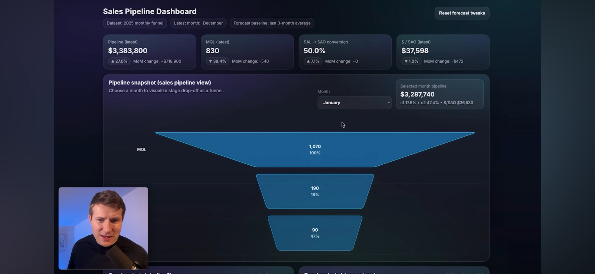

**What to notice:**
- **Funnel chart** shows stage-by-stage drop-off (Prospect → Qualified → Proposal → Negotiation → Closed-Won) — the eye reads *conversion efficiency* directly, not raw counts.
- **Editable forecast controls** (win-rate slider, ACV input, ramp period) with an explicit **Reset** button — the dashboard is *interactive*, not read-only.
- **KPI strip** carries MoM-delta chips (`+3.2%`, `-1 day`) inside each tile — every number carries its own trend, not just a static snapshot.
- **Provenance chip** in the header (`Source · HubSpot · updated 3 min ago`) — the data's origin and freshness are visible without a click.

**Adopted for the build:**
- **Internal Aegira Sales / CRM dashboard (new module)** — funnel chart is the correct primary visualization for our own subscription-sales pipeline (Free → Trial → Tier 1 → Tier 2 → Tier 3), reading directly from Stripe + the Postgres customer table. This is the missing internal ops surface identified in the back-office ERP plan.
- **Every KPI tile across the platform** — carry an MoM / WoW / YoY delta chip inline (green up-arrow, red down-arrow), not just a number. Applies to `Home`, `Dashboard`, `Portfolio → ticker`, `Economics`, `QoE / Diligence`.
- **Provenance chip in every header** — extend `AppShell` and every workbook cover to display `Source · <feed> · updated <n> <unit> ago`. Ties directly to the Data Foundation doctrine (`As-Of-Disclosed`).
- **Interactive forecast controls with Reset** — reused for the Valuation module's what-if pane (WACC slider, terminal-growth input, exit-multiple selector) and for the QoE Cover's "run-rate override" pane.

---

### Reference 08 — AI Crypto Trading Lab *(seven-panel multi-agent workspace)*

This is a full **multi-agent AI trading workspace** — the single richest reference in the filing because it maps almost 1:1 onto Aegira's own multi-VP AI architecture (Vance Ashworth / Ellery Vance / Cy Henry / Marcell Miller). Filed as **seven sub-references** so each pattern is documented individually.

#### 08a — AI Agent Configurator *(control panel before run)*

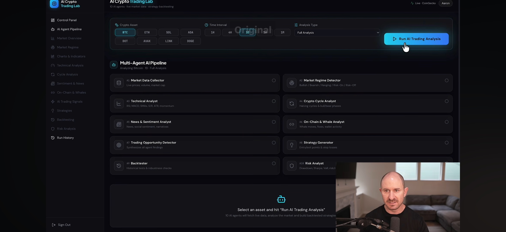

**What to notice:**
- **Chip-based selectors** (Asset: BTC/ETH/SOL/ADA/DOT/AVAX/LINK/DOGE; Interval: 1H/4H/1D/1W/1M) — click-select, no dropdowns for a small enum.
- **Analysis-type dropdown** (Full Analysis / …) — dropdown for larger enums.
- **Single dominant CTA** (`Run AI Trading Analysis`) — one primary action, unmistakable.
- **Pipeline preview** below — the 10 agents that *will* run are visible before you start, so the user knows what they're getting.

**Adopted for the build:**
- **Aegira AI Analysis Console (new module `/analysis`)** — a single page that lets a Tier 2/3 subscriber pick a ticker (chip strip), timeframe (chip strip), and analysis depth (dropdown: Quick / Standard / Full / Diligence), then hits `Run Full Analysis` — kicks off the multi-agent pipeline we already have (`qoe_bridge`, `ratio_dashboard`, `ticker_workbook`, `newsletter_charts`, `macro_regime`).
- **Preview panel** — before the run, show which VPs will contribute (Vance for financials, Ellery for narrative, Cy for engineering QA, Marcell for underwriting) so the subscriber sees the composition of the analysis, not a black box.

#### 08b — Multi-Agent Pipeline *(running, per-agent finding cards)*

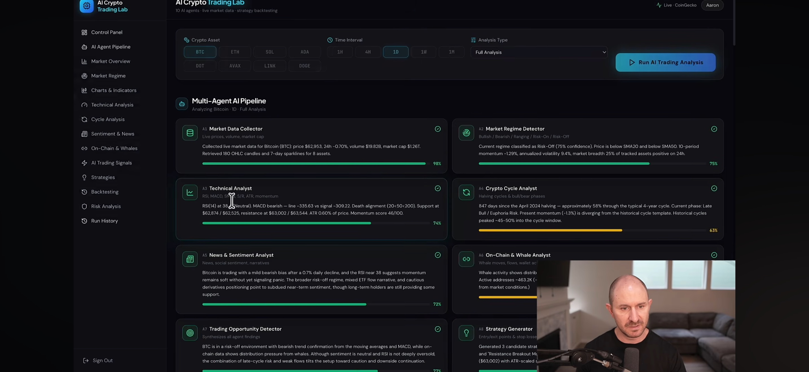

**What to notice:**
- **Each agent gets its own card** with: icon + name + one-line role description + **narrative finding** (2-3 sentences) + **confidence % gauge** (green/amber/red arc) + **progress bar** + **status icon** (in-progress / done).
- Cards are laid out in a **2-column grid** — fast to scan, easy to compare agent findings side-by-side.
- The **finding text is written in the analyst's voice**, not a JSON dump — "RSI(4) at 38 (Neutral); MACD bearish — line -335.03 vs signal -309.22; Death alignment (20>50>200)."

**Adopted for the build — this is the highest-value pattern in the filing after Reference 04:**
- **Aegira multi-VP report layout** — every full-analysis run renders as a grid of agent cards: one per VP (Vance / Ellery / Cy / Marcell / others as added), each with a short narrative finding + confidence gauge + provenance chip.
- **QoE / Diligence workbook cover** — the "Findings & Recommended Actions" section (§10.8 doctrine) becomes a 2-column grid of finding cards, each with its confidence gauge (mapped from evidence grade A/B/C).
- **Newsletter Insider Briefs** — every edition's body becomes a grid of finding cards (one per watched signal), each with the persona byline of the VP who owns that signal.
- **Confidence gauge component** — build once (`src/components/confidence-gauge.tsx`) and reuse across platform + newsletter + workbook exports.

#### 08c — Live Market Overview + Market Regime *(with async completion toast)*

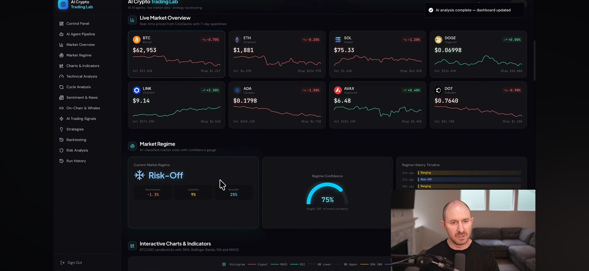

**What to notice:**
- **Live-market price cards** — 8-asset grid, each with logo, symbol, price, Δ% (red/green), 7-day sparkline, volume, and market cap. Uniform layout, dense but readable.
- **Regime label card** — big centered label ("Risk-Off"), snowflake/thermometer icon, sub-metrics (Momentum -1.3%, Volatility 9%, Breadth 25%) below.
- **Confidence gauge** (semi-circular, 75%) beside the regime label — quantifies how sure the classifier is.
- **Regime history timeline** to the right — the last 4 regime classifications with their labels and durations. Instantly shows regime-change frequency.
- **Async completion toast** (`AI analysis complete — dashboard updated`) in the top-right corner — the user knows the pipeline finished without watching for state changes.

**Adopted for the build:**
- **Portfolio → holdings live-tick strip** — the 8-card grid maps directly onto a subscriber's top holdings; feeds from the existing `market_data` polling layer. Uniform card layout, no per-asset special-casing.
- **Economics / Regime module** — port this layout: regime label card (big) + sub-metric row + confidence gauge + regime history timeline. Feeds directly from the existing `backend/app/macro_regime.py` (already computes regime label + confidence + component metrics).
- **Async toast for all long-running jobs** — every full-analysis run, workbook export, and newsletter build emits a completion toast (with a "View" CTA linking to the result). Extend `useToast()` in `src/components/ui/toast.tsx`.

#### 08d — Live Market Overview + Market Regime *(alt view, cursor on card)*

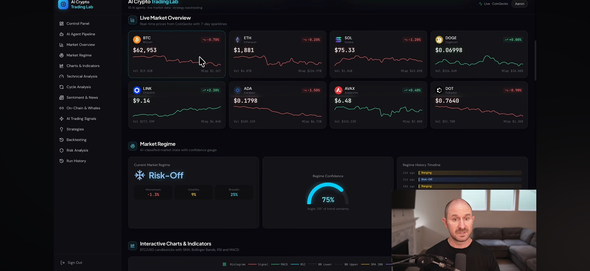

**What to notice:** near-identical to 08c but the toast has cleared and the cursor is hovering the BTC card — reference for the **default (post-toast-dismissed) state**. No new patterns beyond 08c; retained for hover-state design reference.

#### 08e — Charts & Indicators strip *(header state)*

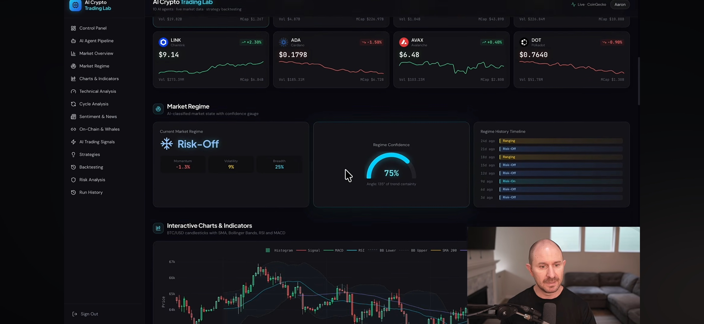

**What to notice:**
- **Section header** (`Interactive Charts & Indicators`) with a **legend row** immediately below listing the overlays that will render: Histogram, Signal, MACD, RSI, BB Lower, BB Upper, SMA 200.
- The **legend is not decorative** — each item is a toggle (implied by the chip styling) letting the user show / hide overlays.

**Adopted for the build:**
- **Portfolio → ticker chart header** — add the same legend-as-toggles strip above the candlestick chart. Users choose which overlays render (RSI on/off, MACD on/off, BB on/off, SMA 20/50/200 on/off). Backend already produces the data; the toggling is a client-side render decision.

#### 08f — Candlestick with technical overlays *(the hero chart)*

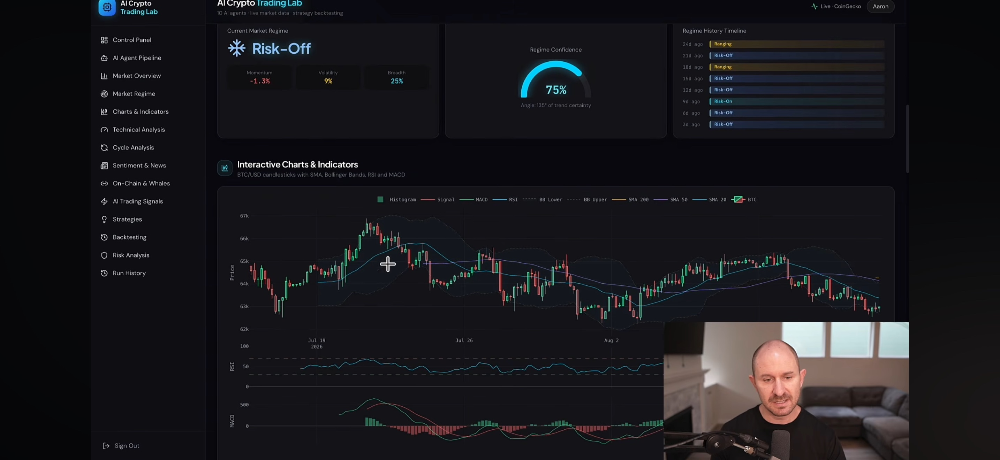

**What to notice:**
- **Candlestick main pane** with Bollinger Bands drawn over the candles and SMA lines.
- **Sub-pane below** for RSI + MACD histogram (traditional split-pane technical layout).
- **Timeframe selector** at the top (1H / 4H / 1D / 1W / 1M) — chip strip, not dropdown.

**Adopted for the build:**
- **Portfolio → ticker "Technicals" tab (P2 build)** — this is the target UI for the candlestick + technical-overlay renderer. The backend already ships candlestick data in `backend/app/ticker_charts.py` and per-timeframe frames in the workbook. The gap is the **on-page interactive renderer**: build `src/components/ticker-candlestick.tsx` using a well-supported library (Lightweight Charts by TradingView is a strong candidate).
- **Newsletter Insider Briefs** — static SVG export of the same layout for the featured ticker in each edition.

#### 08g — Technical Analysis KPI cards + Cycle Analysis section

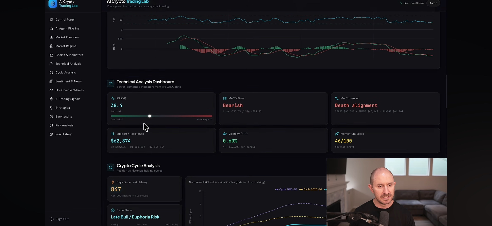

**What to notice:**
- **Technical KPI cards** — each indicator (RSI, MACD, Momentum, ATR, Support, Resistance) gets a tile with the value + a **status classification** (Neutral / Bearish / Bullish) + a mini-gauge or sparkline.
- **Cycle Analysis card** — "847 days since halving; ~58% through the typical 4-year cycle. Late Bull / Euphoria. Present momentum (-1.3%) diverging from the historical cycle template. Historical cycles peaked ~45-50% into the cycle window."
- The cycle card mixes **numeric position, phase label, and historical-context prose** in one tile — analytical density done right.

**Adopted for the build:**
- **Portfolio → ticker "Technicals" tab** — Technical KPI card grid (6 cards) beneath the interactive candlestick. Each card feeds from the already-computed `backend/app/ticker_charts.py` indicators.
- **Portfolio → crypto ticker "Cycle" tab (new)** — cycle-analysis card feeding from a new `backend/app/crypto_cycle.py` module (Bitcoin halving cycle, ETH merge cycle, etc.). Same tile pattern reused for equity market-cycle position (using NBER regime data + `sf1_expanded_backtest.py` outputs — we already have the ingredients).
- **Newsletter Crypto Intelligence** — cycle-analysis card is a natural section lede for every crypto edition.

---

### Reference 09 — P&L dashboard *(light theme, financial-performance decomposition)*

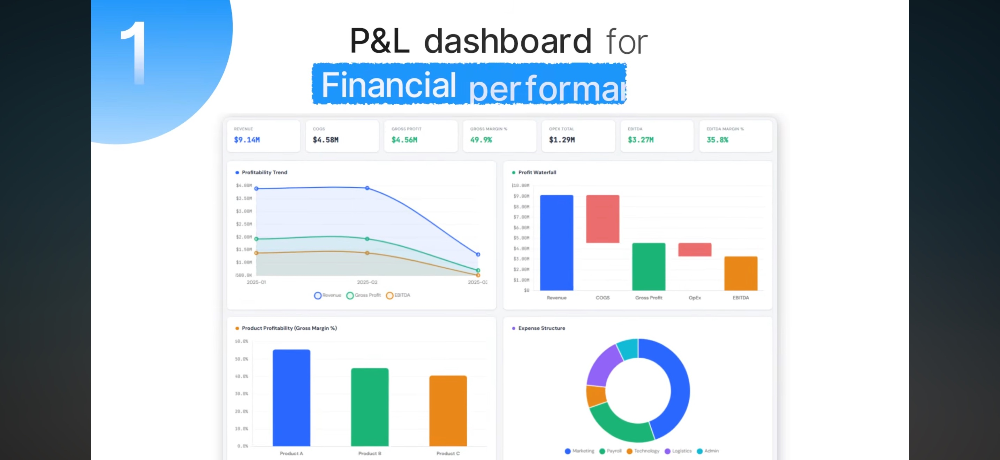

**What to notice:**
- **7-tile KPI strip** carrying the full P&L: Revenue, COGS, Gross Profit, Gross Margin %, OpEx Total, EBITDA, EBITDA Margin % — a complete income-statement summary in one row.
- **Profitability trend** (top-left) — Revenue / Gross Profit / EBITDA on the same axis, so absolute and relative movement are readable in one glance.
- **Profit waterfall** (top-right) — Revenue → COGS → Gross Profit → OpEx → EBITDA as a canonical waterfall. This is the *institutional* P&L decomposition every diligence audience expects.
- **Product-profitability column chart** (bottom-left) — Gross Margin % per product, so product mix drives the read.
- **Expense-structure doughnut** (bottom-right) — Marketing / Payroll / Tech / Logistics / Admin. Composition of OpEx at a glance.
- **Light theme** — reads well in print / PDF export (contrast with the dark trading references).

**Adopted for the build:**
- **QoE / Diligence deliverable** — this is the *exact* P&L cover layout the P1 addendum calls for. Extend `backend/app/excel_export.diligence_workbook` to add a "P&L Overview" sheet with the 7-tile strip + waterfall + product mix + expense doughnut, feeding from the QoE bridge outputs already shipped in [PR #188](https://github.com/marcellmiller27/marcellmiller27/pull/188).
- **Portfolio → ticker "Financials" tab** — same 7-tile strip + trend + waterfall for the polled SF1 / EDGAR P&L. Product-profitability and expense-structure charts render when segment-level data exists; degrade gracefully otherwise (per Data Foundation doctrine).
- **Newsletter Editorial (company deep-dive)** — light-theme P&L cover renders as a static PNG for the featured company, so subscribers see the exact institutional decomposition without opening the workbook.

---

### Reference 10 — Revenue dashboard *(YoY decomposition, dark theme + waterfall)*

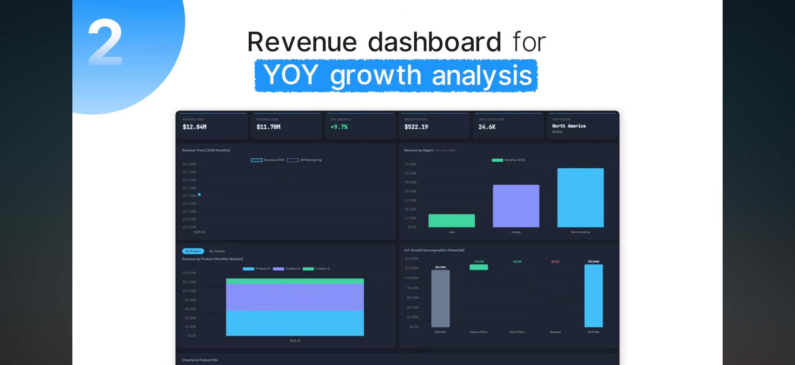

**What to notice:**
- **6-tile KPI strip** — Revenue (current), Revenue (prior), YoY Growth %, Rev / Order, Orders / Month, Top Region.
- **Monthly trend line with 3-month moving-average overlay** — smooths noise while preserving raw signal.
- **Revenue by Region** bar chart — Asia / Europe / North America — instantly shows regional concentration.
- **Stacked area chart with `By Product / By Channel` toggle** — one chart, two decompositions, switched with a segmented control. Density without duplication.
- **YoY Growth Decomposition waterfall** — Prior-year Rev → **Volume Effect** → **Price Effect** → **Residual** → Current-year Rev. This is *the* growth-attribution visual — every serious diligence audience wants to know how much of growth came from more units vs. higher price.
- **Dark theme** — screen-first, high-density.

**Adopted for the build:**
- **QoE / Diligence deliverable** — add a "Revenue Attribution" sheet using this exact layout. YoY decomposition waterfall is the institutional-grade answer to "why did revenue grow?" — feeds from the same `qoe_bridge` inputs (volume, price, mix are already computable from the raw ledgers we ingest).
- **Portfolio → ticker "Financials" tab** — extend with YoY decomposition waterfall using SF1 / EDGAR segment data where available.
- **Newsletter Editorial deep-dive** — YoY decomposition is the natural bridge from "the number" to "the story" for every company feature. Renders as static PNG.
- **Segmented toggle pattern** (`By Product / By Channel`) — reused across the platform wherever a chart has two natural cuts (e.g. Portfolio → holdings by Sector / by Region; Economics → GDP by Contribution / by Region).

---

### Reference 11 — Cost Center dashboard *(dark blueprint, scenario analysis + audit / reconciliation)*

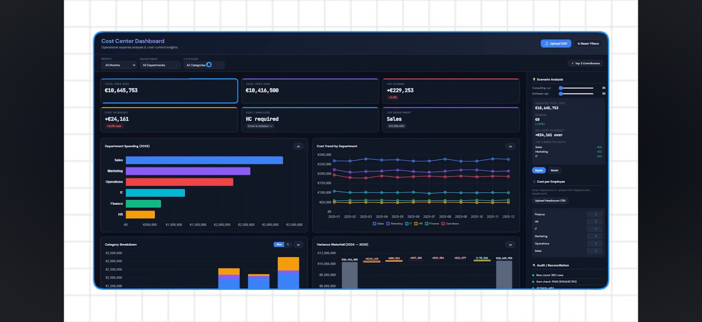

**What to notice:**
- **Filter strip** at the top — Month / Department / Category dropdowns + `Upload CSV` action + `Reset Filters` action. Standardized workspace controls.
- **Six KPI tiles** including one with the label `Cost / Employee: HC required` — the dashboard *asks the user for input* when a metric can't be computed, rather than silently returning N/M. Refreshing pattern.
- **Blueprint-grid background** — visual cue that this is a *workspace*, not a report. Subtle but effective.
- **Scenario analysis panel** on the right — sliders for `Consulting cut`, `Software cut`, a computed `Cost to Budget` output, and explicit `Apply` / `Reset` buttons. The user models a scenario, applies it, sees the effect on the tiles, and resets. Interactive dashboard, not read-only.
- **Cost per Employee panel** — inline `Upload Headcount CSV` control with a listed HC-by-department fallback grid. When automation isn't possible, the dashboard exposes the manual bridge.
- **Audit / Reconciliation panel** on the far right — `Raw count`, `Sum check`, `As-of tick` — the reconciliation-integrity checks that anchor institutional trust. This maps 1:1 onto the §10 audit doctrine.
- **Variance Waterfall** — the year-over-year variance ($10.4M → $10.6M) decomposed by department. Waterfall is again the answer to "what changed."

**Adopted for the build:**
- **Aegira internal cost / burn dashboard (new module `/admin/costs`)** — this is the correct layout for our own back-office ERP cost tracking. Filter strip + KPI tiles + department spending + variance waterfall + scenario sliders + audit panel. Ties directly to the back-office ERP plan already in the queue.
- **Scenario analysis panel** — reused for the Valuation module's what-if pane (WACC slider, terminal-growth input, exit-multiple slider → recomputes IRR / Fair Value / Margin of Safety) and for the QoE Cover's "override run-rate / owner-comp / add-back" pane.
- **Audit / Reconciliation panel** — extend `QoE / Diligence` and every workbook cover to expose the same triple: `Raw count`, `Sum check`, `As-of tick`. Direct implementation of the §10 audit doctrine — makes trust visible.
- **"HC required" input-request pattern** — when a KPI can't be computed for lack of an input, the tile displays the input request inline (with a click-to-upload / click-to-enter action) rather than N/M. Applies to any tile whose blocker is user-supplied data (custom cost basis, target allocation, salary basis, etc.).
- **Blueprint-grid workspace background** — reserved for *interactive workspaces* (Analysis Console, Scenario pane, Portfolio construction). Read-only surfaces stay on the flat dark/light background so the visual distinction between "explore" and "consume" is immediate.

---

## Design-language inventory (extracted from all eleven references)

The building blocks Aegira commits to across every module and every newsletter:

| Building block | Reference(s) | Where it lands |
|---|---|---|
| Fixed left sidebar TOC (icon + label) | 02, 05, 06, 08 | Already shipped in app-shell |
| Status-badge header (green/amber/red pill + short verb) | 02, 04 | `AppShell` hero; QoE Cover; Insider Brief lede |
| 5-tile KPI strip (hero → detail) | 02, 04, 05, 06 | Home; Dashboard; Portfolio ticker; every newsletter edition top |
| **7-tile P&L KPI strip** (Rev / COGS / GP / GM% / OpEx / EBITDA / EBITDAM%) | **09** | **QoE / Diligence cover; Portfolio → ticker "Financials" tab** |
| **KPI-tile delta chip inline** (`+3.2% MoM`, `-1 day WoW`) | **07, 10, 11** | **Every KPI tile across the platform** |
| **Provenance chip in header** (`Source · <feed> · updated <n> <unit> ago`) | **07** | **`AppShell` header; every workbook cover; every newsletter edition** |
| Alerting header block (red-bordered plain-English findings) | 04 | QoE / Diligence cover; Insider Brief top block |
| Executive avatar + persona attribution | 04 | Every deliverable + every newsletter byline |
| Hero filled-area line chart (single, dominant) | 05, 06 | Home hero; Portfolio ticker page; every newsletter section lede chart |
| Companion doughnut / composition ring | 05, 06, 09 | Beside every hero line chart; expense-structure doughnut on QoE Cover |
| **Profit waterfall** (Rev → COGS → GP → OpEx → EBITDA) | **09** | **QoE / Diligence cover; Portfolio → ticker "Financials" tab** |
| **YoY-growth-decomposition waterfall** (Prior → Volume → Price → Residual → Current) | **10** | **QoE / Diligence Revenue Attribution sheet; Portfolio → ticker "Financials" tab** |
| **Multi-line trend by segment / department** (with moving-average overlay) | **10, 11** | **Cost dashboard; Revenue attribution; Portfolio "Financials"; Economics** |
| **Stacked area with segmented `By X / By Y` toggle** | **10** | **Portfolio → holdings; Economics → GDP; Newsletter deep-dives** |
| **Product / segment column chart with per-item gross-margin %** | **09** | **QoE Cover; Portfolio "Financials" segment view** |
| Sortable data table with per-row sparkline | 06 | Portfolio holdings; Newsletter Opportunity Scan rankings |
| World / US map with data overlay | 06 | Economics module; Newsletter regional sections |
| Anomaly-first color rule (green/amber/red = status only) | 03, 04 | Already codified in `ratio_dashboard.py` + `qoe_bridge_workbook.py` (PR #188); extend to every UI surface |
| Mobile-first vertical stack | 03 | `/mobile` route + narrow-viewport rules on `/dashboard` |
| Inline conversion CTA on preview surfaces | 03 | Storefront / free-preview newsletter pages |
| **Sales / pipeline funnel chart** (stage drop-off) | **07** | **Internal Aegira Sales dashboard; Newsletter Main Street Acquirer** |
| **Interactive candlestick + BB / MACD / RSI overlays** (split-pane, legend-as-toggles) | **08e, 08f** | **Portfolio → ticker "Technicals" tab** |
| **Technical KPI card grid** (RSI / MACD / Momentum / ATR / Support / Resistance) | **08g** | **Portfolio → ticker "Technicals" tab; Newsletter Insider Brief per-ticker** |
| **Cycle-analysis card** (days-since-anchor, %-through-cycle, phase label, historical context) | **08g** | **Portfolio → crypto "Cycle" tab; Newsletter Crypto Intelligence lede; equity market-cycle version in Economics** |
| **Regime label card** (big label + icon + sub-metrics + confidence gauge + regime-history timeline) | **08c, 08d** | **Economics / Regime module; Newsletter Insider Briefs lede** |
| **AI-agent configurator strip** (asset chips + interval chips + type dropdown + single big Run CTA) | **08a** | **`/analysis` Analysis Console (new module)** |
| **Multi-agent finding-card grid** (per-agent narrative + confidence gauge + progress + status icon) | **08b** | **QoE / Diligence "Findings & Recommended Actions" cover; Newsletter Insider Briefs body; every full-analysis run output** |
| **Confidence gauge component** (semi-circular arc, 0-100%, green/amber/red band) | **08b, 08c** | **`src/components/confidence-gauge.tsx` (build once, reuse everywhere)** |
| **Async-job completion toast** (top-right, with "View" CTA) | **08c** | **Every long-running job (workbook export, newsletter build, full-analysis run)** |
| **Live-market price-card grid** (8-asset uniform grid: logo / symbol / price / Δ% / sparkline / volume / mcap) | **08c** | **Portfolio → holdings live-tick strip; Home hero (subscriber view)** |
| **Filter strip** (dropdown selectors + Upload CSV + Reset Filters) | **11** | **Every analytical workspace (Cost dashboard, QoE workspace, Valuation what-if)** |
| **Scenario analysis panel** (sliders + Apply / Reset + computed-output tile) | **07, 11** | **Valuation what-if pane; QoE override pane; internal Cost dashboard** |
| **Audit / Reconciliation panel** (Raw count · Sum check · As-of tick) | **11** | **QoE / Diligence workbook cover; every institutional deliverable — direct §10 audit-doctrine surface** |
| **"Input required" KPI-tile pattern** (tile displays inline click-to-enter action when input is missing) | **11** | **Every KPI tile whose blocker is user-supplied data** |
| **Blueprint-grid workspace background** | **11** | **Interactive workspaces only (`/analysis`, `/valuation/what-if`, `/admin/costs`) — read-only surfaces stay flat** |

---

## Platform build mapping

| Aegira module | Adopted references | Concrete build |
|---|---|---|
| **Home** (story of Aegira) | 02, 05, 08c | Status-badge header + 5-tile KPI strip + hero filled-area line + companion doughnut. Subscriber view swaps hero for 8-asset live-market card grid (reference 08c). Numbers polled from the same data foundation the app already uses. |
| **Dashboard** (launchpad) | 02, 04, 05, 07 | Status-badge header + 5-tile KPI strip (each tile carries an inline MoM/YoY delta chip per reference 07) + alerting-header block ("if you read one thing today") + module tiles. |
| **Portfolio → per-ticker page (Overview tab)** | 02, 05, 06, 07 | 5-tile KPI strip (Price · Δ Day · Δ Week · Δ Month · 1-yr) with inline delta chips + provenance chip + hero filled-area line + companion doughnut (sector or fundamentals composition) + sortable ratios table (feeds from the P1 Ratio Dashboard shipped in [PR #188](https://github.com/marcellmiller27/marcellmiller27/pull/188)). |
| **Portfolio → per-ticker "Financials" tab (new)** | 09, 10 | 7-tile P&L KPI strip + profit waterfall + product-profitability column + expense-structure doughnut (reference 09) + YoY-decomposition waterfall (reference 10) + segmented `By Segment / By Region` toggle for revenue trend. Feeds from polled SF1 / EDGAR; degrades gracefully when segment data unavailable. |
| **Portfolio → per-ticker "Technicals" tab (new)** | 08e, 08f, 08g | Interactive candlestick chart with BB / MACD / RSI overlays + legend-as-toggles + timeframe chips (1H/4H/1D/1W/1M) + technical KPI card grid (RSI / MACD / Momentum / ATR / Support / Resistance). Built on `backend/app/ticker_charts.py` outputs. |
| **Portfolio → crypto ticker "Cycle" tab (new)** | 08g | Cycle-analysis card (days-since-halving / merge / anchor + %-through-cycle + phase label + historical-context prose). Feeds from a new `backend/app/crypto_cycle.py` module. Equity variant of the same card in the Economics module uses NBER cycle data + `sf1_expanded_backtest.py` outputs. |
| **Portfolio → holdings** | 06, 08c, 10 | Sortable table with sparkline per row + world-map (regional exposure) + 8-asset live-market card grid at top of page (reference 08c) + segmented `By Sector / By Region` toggle on the composition chart. |
| **Analysis Console (new module `/analysis`)** | 08a, 08b | Configurator strip (asset chips + timeframe chips + depth dropdown + `Run Full Analysis` CTA) + pre-run pipeline preview (which VPs will contribute) + running-state multi-agent finding-card grid (per-VP narrative + confidence gauge + progress bar + status icon) + async-completion toast → "View report" CTA. Kicks off the multi-VP pipeline (`qoe_bridge`, `ratio_dashboard`, `ticker_workbook`, `newsletter_charts`, `macro_regime`) that already exists. |
| **QoE / Diligence** | 04, 08b, 09, 10, 11 | Alerting header (materiality flags from `qoe_bridge`) + exec-attribution avatar + multi-agent finding-card grid for "Findings & Recommended Actions" (§10.8 doctrine) + P&L cover (reference 09: 7-tile strip + waterfall + product-mix + expense doughnut) + Revenue Attribution sheet (reference 10: YoY-decomp waterfall) + scenario-analysis pane for run-rate / owner-comp / add-back overrides (reference 11) + audit / reconciliation panel (raw count · sum check · as-of tick — reference 11) + KPI-strip footer (reported / adjusted seller / adjusted buyer / LTM / run-rate). |
| **Economics / Regime** | 05, 06, 08c, 08d | Hero filled-area line for the featured series + doughnut breakdown + world / US map for spatial series (FDIC by state, EIA by state, OECD by country) + regime label card (big label + icon + sub-metrics + confidence gauge + regime-history timeline — reference 08c/d) sourced from `backend/app/macro_regime.py`. |
| **Valuation** | 02, 05, 11 | Status-badge header (Enter / Accumulate / Sideline) + 5-tile KPI strip (Price · Fair Value · IRR · Margin of Safety · Signal) + hero filled-area of implied fair-value vs. market + scenario / what-if pane (WACC slider, terminal-growth input, exit-multiple selector → recomputes KPIs; Apply / Reset buttons per reference 11). |
| **Reports** | 04 | Alerting header + exec attribution + report cards (already shipped) + KPI-strip preview per card. |
| **Mobile / narrow viewport** | 03 | Vertical color-blocked tile stack + inline CTAs. |
| **Sales / CRM dashboard (new internal module `/admin/sales`)** | 07 | Funnel chart (Free → Trial → Tier 1 → Tier 2 → Tier 3) reading from Stripe + Postgres customer table + editable forecast pane (win-rate slider, ACV input, ramp period) + KPI strip with MoM-delta chips + provenance chip. |
| **Cost / Burn dashboard (new internal module `/admin/costs`)** | 11 | Filter strip (Month / Department / Category + Upload CSV + Reset) + 6-tile KPI grid + department-spending bars + cost-trend multi-line + category breakdown stacked + variance waterfall + scenario-analysis pane with sliders + audit / reconciliation panel. Reads from the back-office ERP feed already in the queue. |

---

## Newsletter build mapping (the Founder's second half — narrative + polled findings)

Every edition adopts a **standard opening layout** so subscribers get the same visual language across editions:

```
[Executive avatar]  [Persona byline]                         [Publication date · edition #]

[Status-badge header — 1 sentence read]

[Alerting block — 2-3 red/amber/green bullets: "what changed since last edition"]

[5-tile KPI strip — the numbers behind the header, from polled data]

[Editor's letter — narrative]           [Hero filled-area line chart]
                                        [Companion doughnut]

[Section 1: heading]
  [narrative prose]                     [chart supporting the narrative]

[Section 2: heading]
  ...
```

**Per-edition specifics:**

| Edition | Adopted references | Concrete layout addition |
|---|---|---|
| **Economic Brief** | 04, 05, 06, 08c | Alerting block ("watch this week"), 5-tile KPI strip (Fed Funds · CPI · Unemp · GDP · 10Y), hero filled-area line for the featured macro series, US map for state/regional series (retail sales, employment, delinquencies by state), regime label card (reference 08c) sourced from `macro_regime.py`. |
| **Insider Briefs** | 02, 04, 05, 08b, 08c, 08g | Status-badge header (regime label with confidence gauge + regime-history timeline, reference 08c) + alerting block (materiality changes across watched signals) + hero filled-area + doughnut for cross-asset regime + **body rendered as a grid of multi-agent finding cards** (reference 08b: one card per watched signal, each with the responsible VP's byline + confidence gauge + narrative finding) + technical KPI cards (reference 08g) for the featured ticker. |
| **Opportunity Scan** | 06, 07 | Sortable ranked table with per-row sparkline (already fits reference 06's "table + sparkline" pattern) + world-map heat for regional opportunity density + per-ticker deep-dive drills reusing the per-ticker page's KPI strip + line + doughnut + funnel chart (reference 07) for how the scan universe was filtered (Universe → Screener → Sector → Rank → Top 10). |
| **Red Alerts** | 04, 08b | Alerting header dominates the top of the edition; each alert becomes its own finding card (reference 08b) with a confidence gauge + persona byline + supporting KPI strip + supporting chart. |
| **Crypto Intelligence** | 05, 06, 08c, 08f, 08g | Hero filled-area (BTC or asset-featured) + doughnut (market-cap split) + sortable table (top movers) + regional exchange-volume world map + **live-market 8-card grid** (reference 08c) + **static candlestick + BB/MACD/RSI export** (reference 08f) for the featured asset + **cycle-analysis card** (reference 08g: days-since-halving, %-through-cycle, phase label) as the section lede. |
| **Dividend Opportunities** | 06, 07 | Sortable ranked table with yield / payout / coverage per row + per-row sparkline for 5-yr yield + funnel chart (reference 07) showing screener stages (Universe → Coverage ratio → Growth → Sustainability → Top 20). |
| **Main Street Acquirer** | 04, 06, 07, 09, 10 | Alerting header (SBA rate change, industry-resilience score change) + KPI strip (median deal size / median multiple / SBA rate / lending volume / recession-resilience %) + sortable table of segments with resilience-score bars + funnel chart (reference 07: Universe → SBA-eligible → Resilience-passed → Multiple-passed → Top 10) + **P&L cover** (reference 09) for the featured target + **YoY revenue-decomposition waterfall** (reference 10). |
| **Editorial / Company Deep-Dive** | 04, 08b, 09, 10 | Alerting header + multi-VP finding-card grid (reference 08b: Vance for financials, Ellery for narrative, Cy for engineering, Marcell for underwriting) + full **P&L cover** (reference 09) + **Revenue Attribution waterfall** (reference 10) as the featured company's institutional decomposition. |

**Backend touchpoints (already exist, extending is straightforward):**
- `backend/app/newsletter_charts.py` — add filled-area, doughnut, and US/world map renderers. Regime quadrant + signal heatmap already exist.
- `backend/app/newsletter_content.py` — extend `EditorLetter` / `Edition` dataclasses with `alerting_block`, `kpi_strip`, `hero_chart` fields.
- `src/components/newsletter-edition.tsx` — extend the renderer to display alerting block + KPI strip + hero chart on top of every edition.

---

## Governance & implementation phasing

**P1 (this doc adopts the language; build lands in follow-up PRs):**
1. Extend `backend/app/newsletter_charts.py` with `filled_area_chart()`, `donut_chart()`, `us_state_map()`, `world_map()`, **`profit_waterfall()`, `yoy_decomposition_waterfall()`, `funnel_chart()`, `regime_history_timeline()`, `confidence_gauge_png()`** renderers.
2. Extend `backend/app/newsletter_content.py` `Edition` dataclass with `alerting_block: list[AlertLine]`, `kpi_strip: list[KPITile]`, `hero_chart: ChartSpec | None`, **`finding_cards: list[FindingCard]`, `provenance: ProvenanceChip`**.
3. Extend `src/components/newsletter-edition.tsx` to render alerting block + KPI strip + hero chart **+ finding-card grid + provenance chip** at the top of every edition.
4. Adopt the QoE / Diligence layout (reference 04) as the Findings & Recommended Actions cover section (already in work group as a P1 follow-up on PR #188).
5. **Build `src/components/confidence-gauge.tsx`** (reference 08b/08c) — semi-circular 0-100% gauge with green/amber/red band. Reused everywhere.
6. **Build `src/components/provenance-chip.tsx`** (reference 07) — `Source · <feed> · updated <n> <unit> ago`. Wired into `AppShell` header and every workbook cover.
7. **Extend every KPI tile** with an inline delta chip (reference 07, 10, 11) — `+3.2% MoM` / `-1 day WoW` / `+€229K YoY`.

**P2 (platform surfaces):**
8. Redo `/home` hero using the reference-05 layout (subscriber view uses reference-08c live-market card grid).
9. Redo `/dashboard` launchpad with the reference-02 KPI-strip and reference-04 alerting header.
10. Redo `/portfolio/[ticker]` per-ticker page with the reference-05 hero-line + doughnut + reference-06 ratios table (feeds from the P1 Ratio Dashboard already shipped).
11. **Build `/portfolio/[ticker]/financials` tab** (references 09, 10) — 7-tile P&L KPI strip + profit waterfall + product-profitability column + expense-structure doughnut + YoY-decomposition waterfall.
12. **Build `/portfolio/[ticker]/technicals` tab** (references 08e, 08f, 08g) — interactive candlestick with BB/MACD/RSI overlays (candidate lib: TradingView Lightweight Charts) + legend-as-toggles + timeframe chips + technical KPI card grid.
13. **Build `/portfolio/[ticker]/cycle` tab** (reference 08g) — for crypto tickers first; extend to equities using NBER data + `sf1_expanded_backtest.py` outputs.
14. **Build `/analysis` Analysis Console** (references 08a, 08b) — configurator strip + pre-run pipeline preview + running-state multi-agent finding-card grid + async-completion toast.
15. **Extend Economics module** with the regime label card + confidence gauge + regime-history timeline (references 08c, 08d), fed by `macro_regime.py`.

**P3 (mobile + spatial data):**
16. Redo `/mobile` with reference-03's vertical color-blocked stack.
17. Add world/US-map component to `Economics` and `Opportunity Scan`.
18. **Build scenario / what-if pane** (reference 11) for the Valuation module (WACC / terminal-growth / exit-multiple sliders → recompute).
19. **Extend QoE / Diligence workbook cover** with the audit / reconciliation panel (reference 11: Raw count · Sum check · As-of tick).

**P4 (internal back-office surfaces):**
20. **Build `/admin/sales`** (reference 07) — subscription-sales funnel (Free → Trial → Tier 1 → Tier 2 → Tier 3) reading from Stripe + Postgres.
21. **Build `/admin/costs`** (reference 11) — filter strip + KPI grid + department bars + trend lines + variance waterfall + scenario sliders + audit panel. Reads from the back-office ERP feed.

**Non-negotiables (from PR #188 governance carry-over):**
- Anomaly-first color rule enforced by `sector_profiles.Status`; no decorative red/amber/green anywhere.
- Every deliverable + every newsletter carries the exec avatar + persona byline + `JHI-SIG: 69M2705M`.
- Data underlying every KPI tile / chart carries its as-of / cadence / freshness (Data Foundation doctrine already shipped).
- Newsletter text stays fact-locked (E2 LLM elevation only rephrases prose; numbers never sent to model).
- **Blueprint-grid background is reserved for interactive workspaces only** (Analysis Console, Scenario what-if, Admin dashboards); read-only surfaces stay flat so the visual distinction between "explore" and "consume" is immediate.

---

*Filed by Cy Henry, VP Software Engineering (AI). JHI-SIG: 69M2705M. Reference images stored under `docs/references/dashboards/`. This filing adopts the visual language; the build lands in follow-up PRs per the phasing above. How we do anything is how we do everything. TeamWork makes the DreamWork.*
